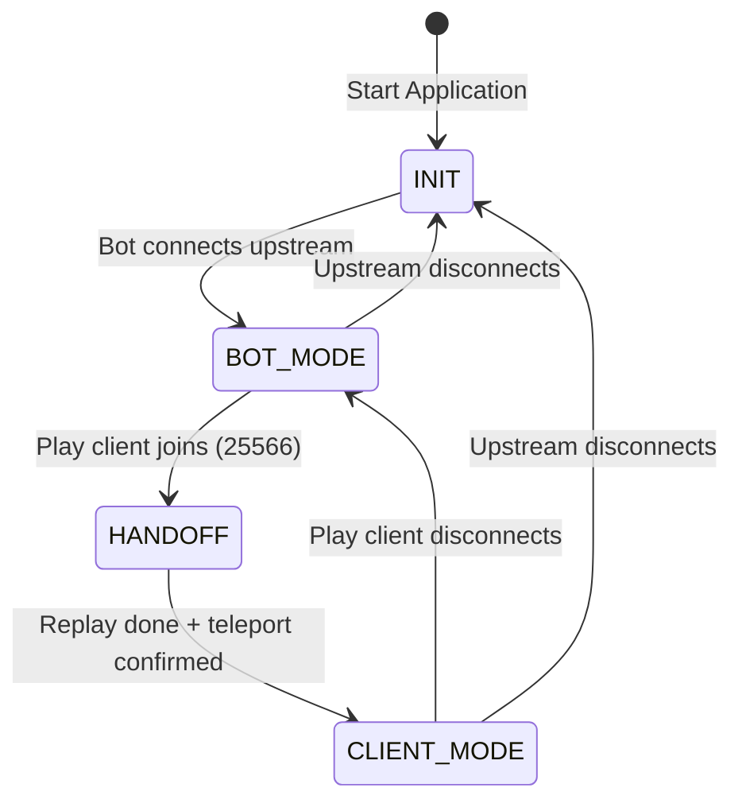

[](https://youtu.be/SlVumVEK9vU)

# 🎮 FlayerProxy

> **A seamless Minecraft Bot-to-Proxy handoff bridge.** Keep your Minecraft character online 24/7, take control from a standard client when you join, and let others watch on a separate spectator port. Includes a packet sniffer that can also create a world download — tested on [Constantiam](https://constantiam.net/) using **1.21.10**.

**Tested with:** Minecraft **1.21.10** on [Paper](https://papermc.io/).

```text
  _____ _                       ____                      
 |  ___| | __ _ _   _  ___ _ __|  _ \ _ __ _____  ___   _ 
 | |_  | |/ _` | | | |/ _ \ '__| |_) | '__/ _ \ \/ / | | |
 |  _| | | (_| | |_| |  __/ |  |  __/| | | (_) >  <| |_| |
 |_|   |_|\__,_|\__, |\___|_|  |_|   |_|  \___/_/\_\\__, |
                |___/                               |___/ 
```

**FlayerProxy** bridges [Mineflayer](https://github.com/PrismarineJS/mineflayer) and [minecraft-protocol](https://github.com/PrismarineJS/node-minecraft-protocol). It connects a bot to your target server, caches world state, runs optional anti-AFK idle behavior when nobody is playing, and exposes local proxy servers so you can:

- **Play** on port **25566** (one client at a time) — handoff without disconnecting from the server.
- **Spectate** on port **25568** (many watchers) — watch-only view of the bot or the controlling player.
  - Planned: coordinate offset to hide real coordinates.

---

## 🚀 How It Works

FlayerProxy runs a state machine between the upstream server, the Mineflayer bot, and local Java clients:



| State | What happens |
| :--- | :--- |
| **`INIT`** | Bot connecting; proxies may listen but play handoff waits for upstream. |
| **`BOT_MODE`** | Bot holds the session, caches S2C packets, optional anti-AFK (look / sneak / swing), optional auto-logout (damage / other players). Spectators can watch on **25568**. |
| **`HANDOFF`** | Play client on **25566**; bot physics off; terrain replay → live chunks → post-terrain (entities/inventory) → held `player_loaded` release ([handoffFlow.js](src/session/handoffFlow.js)). |
| **`CLIENT_MODE`** | [ClientBridge](src/proxy/ClientBridge.js) pipes packets between your client and the bot’s upstream connection. Cache still updates. Replays cached locator waypoints on handoff; live `tracked_waypoint` updates only after a matching `track`. |

Deeper protocol detail: [protocol.md](protocol.md). Implementation map: [codebase_map.md](codebase_map.md).

---

## 🔌 Ports

| Port (default) | Purpose | Clients |
| :--- | :--- | :--- |
| **25566** | **Play** — take control of the bot character | **1** (second login rejected) |
| **25568** | **Spectator** — watch only, no upstream control | Up to **20** (configurable) |
| **25567** | **Sniffer** (dev) — MITM logging, not the main proxy | 1 |

Point Minecraft at `localhost:25566` to play, or `localhost:25568` to spectate. Do not use the sniffer port for normal play unless you are capturing traffic (`npm run sniffer`).

---

## 🛠️ State Cache System

Caches keep handoff and spectator join smooth. Chunks are stored only within the bot’s view distance and pruned when the view center moves.

| Cache | Packets (examples) | Notes |
| :--- | :--- | :--- |
| **Chunks** | `map_chunk`, `update_light`, `unload_chunk`, `block_change`, `multi_block_change` | LRU (default 1024); merges into prismarine columns via [chunkMerge.js](src/state/chunkMerge.js). Handoff **re-encodes** from merged columns ([mapChunkWire.js](src/utils/mapChunkWire.js)), not stored wire bytes. |
| **Entities** | `spawn_entity`, metadata, equipment, effects, movement, `entity_destroy` | Replay spawns for handoff / spectators. |
| **Player** | `login`, `position`, health, XP, abilities, difficulty, respawn | Drives replay login and teleport. |
| **Inventory** | `window_items`, `set_slot`, hotbar, cursor | Play handoff only (spectators skip inventory). |
| **Misc** | time, weather, border, tab list, scoreboard, tags, boss bar, `tracked_waypoint` | Level info and UI sync; locator waypoints replayed on handoff. |

**Replay vs live:** Handoff replays **in-view cached chunks** (encoded on the proxy serializer). During `HANDOFF`, live `map_chunk` from the bot connection is also forwarded until [ClientBridge](src/proxy/ClientBridge.js) starts. In `CLIENT_MODE`, the bridge forwards **all** upstream `map_chunk` packets and keeps `update_view_position` ahead of the player so vanilla accepts chunks outside the replayed set.

---

## 👁️ Spectator mode

- Separate `minecraft-protocol` server on `config.spectator.port` (default **25568**).
- [SpectatorHub](src/spectator/SpectatorHub.js) replays world state in **spectator gamemode**, locks **camera** to the bot entity, and fans out upstream S2C packets.
- Movement and interaction C2S are not sent upstream; camera and position are re-locked if the client tries to move.
- Idle bot arm swings and sneak/crouch are relayed synthetically (`animation`, `entity_metadata`) — the server does not echo the bot’s own swing or shift pose on its connection. The same applies when you play on **25566** (`player_input` shift).
- Locator / Journeys (`tracked_waypoint`) are cached while the bot is online and replayed as `track` on join; orphan `update` packets are dropped so vanilla does not disconnect.

Works in **`BOT_MODE`** (watch bot + idle behavior) and **`CLIENT_MODE`** (watch the human player’s stream).

---

## 🚪 Auto logout (bot mode only)

While no play client is connected (`BOT_MODE`), the bot can quit upstream when:

- **`onDamage`** — the bot takes damage (`entityHurt` on the bot entity).
- **`onPlayer`** — any player entity not in `allowedPlayers` spawns in range. The bot’s own username is always allowed.
- **`belowY`** — the bot’s Y coordinate drops below the configured value (default `64`). Set to `false` to disable.

Auto logout is **disabled** during handoff and while a play client controls the session (`HANDOFF` / `CLIENT_MODE`). After a trigger the bot disconnects upstream and stays offline (no background reconnect). **Spectators** are rejected with `Bot Auto disconnected`.

**Reconnect:** Join on the **play port** (25566). During configuration, `login_acknowledged` runs `_preparePlayLogin`: reconnect the bot if needed, replay upstream config, prime the chunk cache (up to ~12s), then finish configuration. You get a system chat notice on handoff, then terrain replay → entities/inventory → release held `player_loaded` → `CLIENT_MODE`. If terrain was sparse, handoff streams live `map_chunk` and sends proxy `chunk_batch_received` upstream so the server keeps sending chunks.

---

## ⚙️ Configuration

Edit `config.json` in the project root:

```json
{
  "server": {
    "host": "192.168.178.58",
    "port": 25565,
    "version": "1.21.10"
  },
  "auth": {
    "username": "FlayerBot",
    "auth": "microsoft"
  },
  "proxy": {
    "host": "0.0.0.0",
    "port": 25566,
    "onlineMode": true,
    "maxClients": 1,
    "clientViewDistance": 10
  },
  "spectator": {
    "enabled": true,
    "host": "0.0.0.0",
    "port": 25568,
    "onlineMode": true,
    "maxClients": 20
  },
  "sniffer": {
    "port": 25567,
    "onlineMode": false,
    "upstreamAuth": "microsoft",
    "logDir": "logs/sniffer",
    "saveLevel": true,
    "saveLevelDir": "logs/sniffer/worlds"
  },
  "bot": {
    "antiAfk": true,
    "antiAfkMinInterval": 1500,
    "antiAfkMaxInterval": 6000,
    "viewDistance": 10,
    "autoLogout": {
      "enabled": true,
      "onDamage": true,
      "onPlayer": true,
      "belowY": 64,
      "allowedPlayers": ["tobbop2", "craftery85"]
    }
  },
  "cache": {
    "maxChunks": 1024,
    "trackEntities": true
  }
}
```

### Options

| Section | Keys | Description |
| :--- | :--- | :--- |
| **`server`** | `host`, `port`, `version` | Upstream server; `version` must match (e.g. `1.21.10`). |
| **`auth`** | `username`, `auth` | Bot credentials: `"microsoft"` or `"offline"`. |
| **`proxy`** | `host`, `port`, `onlineMode`, `maxClients`, `clientViewDistance` | Play proxy (**25566**). `maxClients` is **1**. `clientViewDistance` is the java render target when play has no C2S `settings` (1.21+). |
| **`spectator`** | `enabled`, `host`, `port`, `onlineMode`, `maxClients` | Watch-only proxy (**25568**). Set `enabled: false` to disable. |
| **`sniffer`** | `port`, `onlineMode`, `upstreamAuth`, `logDir`, … | Dev MITM on **25567**; see [protocol.md §11](protocol.md#11-packet-sniffer-development). |
| **`bot`** | `antiAfk`, `antiAfkMinInterval`, `antiAfkMaxInterval`, `viewDistance`, `autoLogout` | Idle look/sneak/swing when no play client; chunk cache radius hint. `autoLogout`: `enabled`, `onDamage`, `onPlayer`, `belowY`, `allowedPlayers` (bot username always allowed). |
| **`cache`** | `maxChunks`, `trackEntities` | LRU chunk cap and entity tracking. |

---

## 📁 Project Structure

```text
├── config.json             # Runtime settings
├── README.md               # This file
├── protocol.md             # Vanilla + FlayerProxy protocol notes
├── codebase_map.md         # Classes, methods, diagrams
├── package.json
└── src
    ├── index.js            # Entry point
    ├── config.js           # Config loader & defaults
    ├── constants/          # rawPackets, spectatorPackets
    ├── proxy/
    │   ├── ProxyServer.js       # Play listener (25566)
    │   ├── SpectatorProxyServer.js
    │   └── ClientBridge.js      # CLIENT_MODE packet pipe
    ├── spectator/
    │   └── SpectatorHub.js      # Multi-spectator fan-out
    ├── session/
    │   ├── SessionManager.js
    │   ├── ServerConnection.js  # Mineflayer + packet capture
    │   ├── BotIdleBehavior.js   # Anti-AFK idle actions
    │   ├── BotAutoLogout.js     # Damage / player auto-disconnect
    │   ├── ChunkAckManager.js
    │   ├── MovementRelay.js
    │   ├── tickEndRelay.js      # CLIENT_TICK_END relay for Grim
    │   └── handoffFlow.js       # performHandoff orchestration
    ├── state/
    │   ├── WorldStateCache.js
    │   ├── ChunkCache.js
    │   ├── chunkMerge.js
    │   └── …                    # Entity, inventory, misc caches
    ├── replay/
    │   ├── StateReplayer.js
    │   ├── replayChunks.js
    │   └── replayHelpers.js
    ├── sniffer/                 # Optional MITM logger (25567)
    └── utils/
        ├── configReplay.js      # login_acknowledged config replay
        ├── handoffSync.js       # HANDOFF gate, relays, chunk ack
        ├── handoffTrace.js      # [Handoff] structured logging
        ├── viewDistance.js      # server/bot/java view distance sync
        ├── playPacketWire.js    # S2C writeRaw / encoded map_chunk
        ├── mapChunkWire.js      # handoff chunk encode helper
        └── clientDisconnect.js  # Graceful proxy disconnect
```

---

## 🚦 Getting Started

### Prerequisites

- [Node.js](https://nodejs.org/) v18+
- Minecraft Java Edition matching `server.version`
- Valid account if using online-mode upstream or proxy (`auth`: `"microsoft"`)

### Install

```bash
git clone <repository-url>
cd flayerproxy
npm install
```

### Run

1. Copy and edit `config.json`.
2. Start the proxy:

   ```bash
   npm start
   ```

3. In Minecraft:
   - **Play:** Direct connect to `127.0.0.1:25566` (or your `proxy.port`).
   - **Spectate:** Direct connect to `127.0.0.1:25568` (or your `spectator.port`).

Only **one** play client can be connected at a time. Wait for the bot to be in the world (`BOT_MODE`) before joining to play. After **auto logout**, the bot is offline until you connect on the play port; the login screen may show “Reconnecting…” while the bot reconnects.

### Packet sniffer (optional)

```bash
npm run sniffer
```

Connect the Java client to **25567** to log decrypted traffic to `logs/sniffer/`. When the session ends, captured `map_chunk` columns are written as a Java **1.21.10** world under `logs/sniffer/worlds/<sessionId>/` (`region/` + `level.dat`). Copy that folder into `.minecraft/saves/` and open it in Singleplayer. Set `sniffer.saveLevel: false` to disable. See [protocol.md](protocol.md).

---

## 🧪 Technical Notes

- **Registry replay:** Configuration-phase `registry_data` (and related packets) are captured from the upstream server and replayed with `writeRaw` to joining play and spectator clients so registries match the real server. `cookie_request` is skipped in config replay; play bridge blocks `cookie_request` / `store_cookie` on the proxy client.
- **Play login race:** `login_acknowledged` is handled synchronously on proxy `login`; `preparePlayLogin` (auto-logout reconnect + chunk prime) runs in `beforeConfigReplay` so the client is not stuck on “Joining World”.
- **Chunk priming:** Before handoff replay, `_primeChunksNearBot` waits for enough in-view cached chunks (`minChunksForHandoff`) via `confirmServerPosition` and upstream `map_chunk` capture. Default wait 1.5s; **12s** after auto-logout reconnect.
- **Handoff order:** Terrain replay first (`deferPostTerrain`), then live chunk forward + proxy `chunk_batch_received`, `confirmServerPosition`, `replayPostTerrain` (tab list, entities, inventory), then **release** any held java `player_loaded` upstream. The proxy never sends `player_loaded` itself.
- **View distance (1.21+):** Server `simulation_distance` + `update_view_distance` are cached; bot `viewDistance` and `proxy.clientViewDistance` set upstream radius and java render/sim via [viewDistance.js](src/utils/viewDistance.js). Loaded area is roughly `(2×sim+1)²` chunks (e.g. sim=5 → ~11×11).
- **Chunk replay encode:** Cached columns are exported with `prepareMapChunkParams` and written on the **proxy client serializer** ([mapChunkWire.js](src/utils/mapChunkWire.js)). Live/handoff S2C uses [playPacketWire.js](src/utils/playPacketWire.js) (`writeRaw` when wire bytes exist; encode `map_chunk` otherwise).
- **Grim setbacks:** S2C `position` with relative yaw/pitch is accepted on the bot (`teleport_confirm` + `position_look`) and forwarded to the java client on the same packet (wire bytes preserved). All setbacks are forwarded — not coalesced.
- **Chunk batches:** During `HANDOFF`, java `chunk_batch_received` / `player_loaded` relay upstream (with `player_loaded` **held** until post-terrain). `ClientBridge.start()` enables client-driven acks and `flushChunkBatchAck()`.
- **Keep-alive:** The bot answers upstream keep-alives; the proxy avoids duplicating them on the local play client to prevent sequence kicks.
- **Handoff position:** Replay sends `position` and waits for `teleport_confirm` before terrain; `confirmServerPosition` runs before post-terrain replay.
- **Graceful shutdown:** Ctrl+C sends disconnect payloads to play/spectator clients, replays config end where needed, then closes sockets after a short delay so vanilla login handlers do not race `client.end()`.
- **Logging:** `[Handoff]` lines in logs trace C2S/S2C during handoff ([handoffTrace.js](src/utils/handoffTrace.js)).

