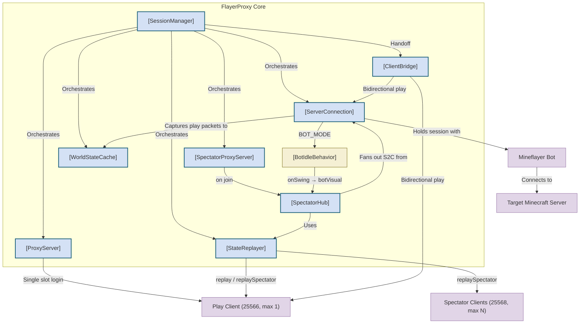
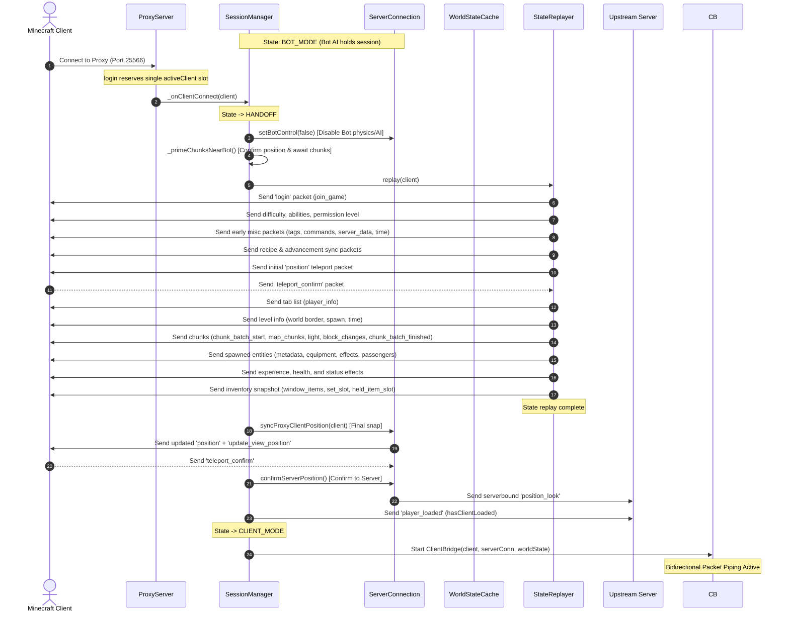
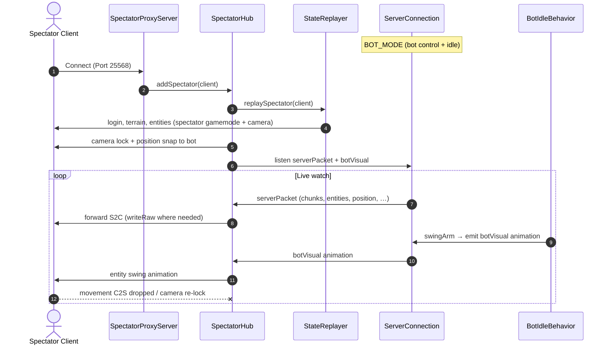
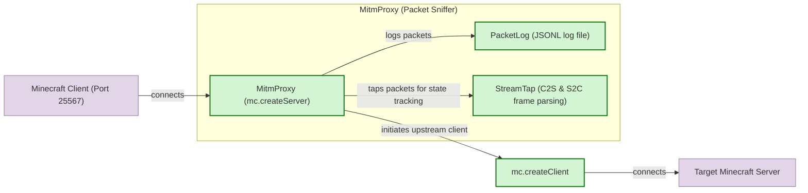

# 🗺️ FlayerProxy Codebase Map

This document provides a comprehensive mapping of all the classes, functions, and files in the `src/` directory of **FlayerProxy**, along with Mermaid diagrams showing how the components interact during different modes of operation.

---

## 📑 Table of Contents

- [Architecture & Interaction Diagrams](#-architecture--interaction-diagrams)
  - [High-Level Core System](#1-high-level-core-system-diagram)
  - [Client Handoff Flow](#2-client-handoff-flow-diagram)
  - [Spectator Watch Flow](#3-spectator-watch-flow-diagram)
  - [MITM Sniffer Architecture](#4-mitm-sniffer-architecture-diagram)
- [Cross-Cutting Behavior](#-cross-cutting-behavior)
- [Detailed File Mapping](#-detailed-file-mapping)
  - [Root Scripts & Configuration](#1-root-scripts--configuration) — `src/index.js`, `src/config.js`
  - [session — Session State Machine](#2-session--session-state-machine) — `SessionManager`, `ServerConnection`, `BotIdleBehavior`, `ChunkAckManager`, `MovementRelay`, `handoffFlow`
  - [proxy — Client Connection Proxy](#3-proxy--client-connection-proxy) — `ProxyServer`, `ClientBridge`
  - [spectator — Watch-Only Multi-Client Proxy](#4-spectator--watch-only-multi-client-proxy) — `SpectatorProxyServer`, `SpectatorHub`, `spectatorPackets`
  - [state — World State Caching](#5-state--world-state-caching) — `WorldStateCache`, `ChunkCache`, `chunkMerge`, entity/player/inventory/misc caches
  - [replay — Client Handoff Replay](#6-replay--client-handoff-replay) — `StateReplayer`, `replayChunks`, `replayHelpers`
  - [utils — Helper Utilities](#7-utils--helper-utilities) — `angles`, `chatRelay`, `clientDisconnect`, `handoffSync`, `logger`, `positionSync`
  - [constants — Shared Packet Sets](#8-constants--shared-packet-sets) — `rawPackets`, `spectatorPackets`
  - [sniffer — MITM Packet Sniffer](#9-sniffer--mitm-packet-sniffer) — `MitmProxy`, `TransparentProxy`, `StreamTap`, `PacketLog`, and relay modules

---

## 🏗️ Architecture & Interaction Diagrams

### 1. High-Level Core System Diagram

This diagram shows how the core components cooperate across **play** (single client, port 25566), **spectator** (multi-client watch-only, port 25568), and **bot mode** (idle behaviour when no player is connected).

---

### 2. Client Handoff Flow Diagram

This sequence diagram shows the step-by-step handoff process when a standard Minecraft client connects to the proxy, disabling the bot's AI, replaying the cached state, and establishing the packet-forwarding bridge.

---

### 3. Spectator Watch Flow Diagram

Spectators connect on a **separate port** (default 25568). They receive a spectator replay, then a read-only fan-out of upstream S2C packets. Movement is blocked; the camera is locked to the bot entity. Idle arm swings are synthesized locally (the server does not echo the bot's own swing).

---

### 4. MITM Sniffer Architecture Diagram

The Packet Sniffer has two modes of operation:

* **MitmProxy**: Decrypts both the client leg and the server leg using custom negotiated encryption keys to print and inspect packet structures in real time.
* **TransparentProxy**: Pipes TCP streams directly without decryption, using a non-disruptive `StreamTap` to record unencrypted packets (like status handshakes or offline logins).

---

## 🔑 Cross-Cutting Behavior

Summary of policies that span multiple modules (not obvious from individual class tables).

### Ports and connection policy

| Port (default) | Listener | Max clients | When accepted |
| :--- | :--- | :--- | :--- |
| **25566** | [ProxyServer](file:///home/seb/flayerproxy/src/proxy/ProxyServer.js) | **1** | `BOT_MODE` only; slot reserved on `login`, released on reject/disconnect |
| **25568** | [SpectatorProxyServer](file:///home/seb/flayerproxy/src/proxy/SpectatorProxyServer.js) | **20** (configurable) | Upstream connected and not `INIT`/`HANDOFF`; allowed in `BOT_MODE` (bot control) or `CLIENT_MODE` |

Disable spectators with `spectator.enabled: false` in `config.json`.

### Chunk cache vs live forwarding

| Phase | `map_chunk` behavior |
| :--- | :--- |
| **Bot session (cache)** | [ChunkCache](file:///home/seb/flayerproxy/src/state/ChunkCache.js) stores only chunks within view distance of the bot view center (`update_view_position` or player position + `update_view_distance`). Out-of-view chunks are skipped on ingest and pruned via `forgetOutsideView`. |
| **Handoff replay** | [StateReplayer](file:///home/seb/flayerproxy/src/replay/StateReplayer.js) + `getChunksForReplay()` send **only** in-view cached chunks (nearest-first). |
| **CLIENT_MODE bridge** | [ClientBridge](file:///home/seb/flayerproxy/src/proxy/ClientBridge.js) forwards **all** upstream `map_chunk` packets. May send `update_view_position` so the client accepts chunks outside its local cache radius. |

Chunks are **server-pushed**; the bot/client mainly acks via `chunk_batch_received` and movement/view packets.

### Block/light merge and `structuredClone`

`map_chunk` binary fields (`chunkData`, heightmaps, etc.) must stay as Node `Buffer` instances for prismarine-chunk / smart-buffer. `structuredClone` in the cache path can turn them into `Uint8Array`, which breaks merges (`Invalid Buffer provided in SmartBufferOptions`). [chunkMerge.js](file:///home/seb/flayerproxy/src/state/chunkMerge.js) normalizes via `asBuffer()` / `normalizeMapChunkPacket()` before column load and merge.

### Spectator watch (movement and visuals)

- **Movement:** Vanilla spectator free-cam is largely client-side. The proxy cannot rely on dropping C2S alone; [SpectatorHub](file:///home/seb/flayerproxy/src/spectator/SpectatorHub.js) locks the camera to the bot entity (`camera` packet), snaps position on movement C2S, and runs a 1s correction loop.
- **Idle swing:** The server does not echo the bot’s own arm swing. [BotIdleBehavior](file:///home/seb/flayerproxy/src/session/BotIdleBehavior.js) → [ServerConnection._emitBotSwingAnimation](file:///home/seb/flayerproxy/src/session/ServerConnection.js) → `botVisual` → spectator `animation` fan-out.

### Bot idle (no play client)

While in `BOT_MODE` with bot control enabled, [BotIdleBehavior](file:///home/seb/flayerproxy/src/session/BotIdleBehavior.js) runs random look / sneak / swing on a timer (`config.bot.antiAfk*`). Started/stopped with [ServerConnection.setBotControl](file:///home/seb/flayerproxy/src/session/ServerConnection.js).

---

## 🗂️ Detailed File Mapping

### 1. Root Scripts & Configuration

#### 📄 [src/index.js](file:///home/seb/flayerproxy/src/index.js)

The main entry point for the application. Loads system config, logs play and spectator proxy ports, starts [SessionManager](file:///home/seb/flayerproxy/src/session/SessionManager.js), hooks `SIGINT`/`SIGTERM` for graceful shutdown, and captures `uncaughtException` / `unhandledRejection`.

| Function | Description |
|---|---|
| `shutdown(signal)` | Gracefully stops the proxy and exits the node process. |

#### 📄 [src/config.js](file:///home/seb/flayerproxy/src/config.js)

Handles configuration loading, validation, and parsing.

| Function | Description |
|---|---|
| `loadConfig()` | Synchronously reads `config.json`, validates host, port, version, and auth configuration, applies defaults for `proxy`, `spectator`, `bot` (anti-Afk intervals), and `cache`, and returns the configuration object. |

**Default config sections:** `proxy` (port 25566, `maxClients: 1`), `spectator` (port 25568, `maxClients: 20`, `enabled: true`), `bot` (`antiAfk`, `antiAfkMinInterval`, `antiAfkMaxInterval`, `viewDistance`).

---

### 2. session — Session State Machine

#### 🧩 [SessionManager](file:///home/seb/flayerproxy/src/session/SessionManager.js) `class`

Orchestrates the dual-mode proxy state machine: `INIT` ↔ `BOT_MODE` ↔ `HANDOFF` ↔ `CLIENT_MODE`.

| Method | Description |
|---|---|
| `constructor(config)` | Initializes state machine, play proxy, optional spectator proxy/hub, and replayer. |
| `start()` | Connects upstream bot, starts play proxy (25566), and spectator proxy (25568) if enabled. |
| `_scheduleReconnect(delaySec)` | Schedules a timed reconnect sequence if the connection is lost. |
| `_setupServerEvents()` | Hooks upstream server events (`connected`, `disconnected`, `kicked`, `error`, `death`, `respawn`). |
| `_primeChunksNearBot()` | Triggers server movement packets to verify that the chunk cache is loaded near the bot before handing off. |
| `_refreshClientAfterBotRespawn()` | Re-aligns position and client view in case the bot respawns while a client is connected. |
| `_clientSlotStatus()` | Returns whether the play port may accept a new login (single client, `BOT_MODE` only). |
| `_spectatorSlotStatus()` | Returns whether the spectator port may accept logins (connected, not `INIT`/`HANDOFF`; `BOT_MODE` with bot control or `CLIENT_MODE`). |
| `_rejectClient(client, reason)` | Kicks play client and releases `ProxyServer.activeClient` slot. |
| `_onClientConnect(client)` | Validates play slot, then handoff `BOT_MODE` → `CLIENT_MODE`. |
| `_cleanupClient()` | Stops bridge, releases play client slot, clears `currentClient`. |
| `_transitionTo(newState)` | Transitions the machine state and logs status summaries. |
| `stop()` | Gracefully halts all services. |

#### 🧩 [ServerConnection](file:///home/seb/flayerproxy/src/session/ServerConnection.js) `class` extends `EventEmitter`

Manages the persistent Mineflayer bot connection to the target server.

| Method | Description |
|---|---|
| `constructor(config, worldState)` | Initializes bot connection manager with config and world state reference. |
| `connect()` | Spawns the bot connection via Mineflayer. |
| `_setupConfigCapture()` | Caches configuration-phase registry data and tags. |
| `_setupPacketCapture()` | Hooks play packets and routes them directly to the state cache. |
| `_setupBotEvents()` | Listens for bot lifecycle events; creates [BotIdleBehavior](file:///home/seb/flayerproxy/src/session/BotIdleBehavior.js) on spawn. |
| `_emitBotSwingAnimation(hand)` | Emits `botVisual` (`animation` packet) so spectators see idle swings (server does not echo self-swing). |
| `setBotControl(enabled)` | Enables/disables physics; starts/stops [BotIdleBehavior](file:///home/seb/flayerproxy/src/session/BotIdleBehavior.js). |
| `setClientDrivesChunkBatchAck(clientDrives)` | Delegates chunk batch acknowledgement control between client and Mineflayer. |
| `flushChunkBatchAck()` | Unblocks the server chunk sender. |
| `refreshProxyClientPermissions(client)` | Sends player permissions status packets. |
| `syncProxyClientPosition(client)` | Snaps client position coordinates to the bot. |
| `confirmServerPosition()` | Confirms final block coordinates back to the server. |
| `setProxyClientChunkAck(enabled)` | Configures the [ChunkAckManager](file:///home/seb/flayerproxy/src/session/ChunkAckManager.js). |
| `relayClientMovement(name, data)` | Translates Notchian/mineflayer coordinates and forwards client movements upstream. |
| `writeToServer(name, data)` | Writes raw packets directly upstream. |
| `disconnect()` | Safely disconnects the bot. |

**Events:** `connected`, `disconnected`, `kicked`, `error`, `death`, `respawn`, `serverPacket` `(name, data, buffer)`, `botVisual` `(name, data)` (synthetic S2C for spectators).

#### 🧩 [ChunkAckManager](file:///home/seb/flayerproxy/src/session/ChunkAckManager.js) `class`

Intercepts Mineflayer's chunk batch acknowledgement listeners to prevent double-acknowledging packets during the client session.

| Method | Description |
|---|---|
| `constructor()` | Initializes acknowledgement state. |
| `disable(rawClient)` | Disables auto-acknowledgement on the client stream. |
| `restore(rawClient)` | Restores Mineflayer auto-acknowledgement. |
| `flush(rawClient)` | Sends a manual chunk batch received acknowledgement packet. |

#### 📄 [MovementRelay.js](file:///home/seb/flayerproxy/src/session/MovementRelay.js) `functions`

| Function | Description |
|---|---|
| `relayClientMovement(bot, rawClient, name, data)` | Applies client movement packets to the bot entity structure and writes updates upstream. |
| `syncProxyClientPosition(bot, worldState, client)` | Sends a teleport/position packet to the client and awaits a matching `teleport_confirm`. |
| `confirmServerPosition(bot, rawClient, connected)` | Writes a `position_look` verification packet to the upstream server. |

#### 📄 [handoffFlow.js](file:///home/seb/flayerproxy/src/session/handoffFlow.js) `functions`

| Function | Description |
|---|---|
| `performHandoff({...})` | Coordinates the sequential handoff sequence: installs temporary upstream forwarding rules, primes nearby chunks, triggers the [StateReplayer](file:///home/seb/flayerproxy/src/replay/StateReplayer.js), aligns player coordinates/permissions, and spawns the [ClientBridge](file:///home/seb/flayerproxy/src/proxy/ClientBridge.js). |

#### 🧩 [BotIdleBehavior](file:///home/seb/flayerproxy/src/session/BotIdleBehavior.js) `class`

Random look / sneak / swing while the bot holds the session (`BOT_MODE`, no play client). Started from [ServerConnection.setBotControl(true)](file:///home/seb/flayerproxy/src/session/ServerConnection.js).

| Method | Description |
|---|---|
| `constructor(bot, botConfig, hooks)` | Optional `onSwing(hand)` hook for spectator animation relay. |
| `start()` / `stop()` | Enables/disables timed idle actions (`config.bot.antiAfk`). |
| `_scheduleNext()` | Random delay between `antiAfkMinInterval` and `antiAfkMaxInterval`. |
| `_tick()` | Picks random action: look, sneak, or swing. |
| `_randomLook()` | `bot.look()` with small yaw/pitch delta. |
| `_randomSneak()` | Toggles sneak via `setControlState` for a random duration. |
| `_randomSwing()` | `bot.swingArm()` then `onSwing` callback. |

---

### 3. proxy — Client Connection Proxy

#### 🧩 [ProxyServer](file:///home/seb/flayerproxy/src/proxy/ProxyServer.js) `class`

Listens for connection attempts from standard Minecraft Java clients.

| Method | Description |
|---|---|
| `constructor(config, onClientConnect, worldState, canAcceptClient)` | Play proxy; optional `canAcceptClient()` gate from [SessionManager](file:///home/seb/flayerproxy/src/session/SessionManager.js). |
| `releaseClient(client)` | Clears `activeClient` if it matches (used on reject/disconnect). |
| `start()` | `mc.createServer` on `config.proxy.port`; **reserves single slot on `login`**; replays raw config on `login_acknowledged`; `playerJoin` only for reserved client. |
| `updateRegistryCodec(codec)` | Replaces the registry codec object in the protocol handler options. |
| `stop()` | Disconnects active client and closes listener. |

#### 🧩 [ClientBridge](file:///home/seb/flayerproxy/src/proxy/ClientBridge.js) `class`

Manages bidirectional packet pipelines when in `CLIENT_MODE`.

| Method                                           | Description                                                                                                                                                                                        |
| --------------------------------------------------| ----------------------------------------------------------------------------------------------------------------------------------------------------------------------------------------------------|
| `constructor(client, serverConn, worldState)`    | Initializes bridge with client, server connection, and world state references.                                                                                                                     |
| `_getViewDistance()`                             | Resolves the view distance from configuration or state records.                                                                                                                                    |
| `_syncClientViewFromBlockCoords(blockX, blockZ)` | Computes chunk coordinates and updates client view center position.                                                                                                                                |
| `_syncClientViewFromBot()`                       | Aligns client view center with the bot entity position.                                                                                                                                            |
| `_playerBlockCoordsForView()`                    | Returns coordinates representing the client player's view anchor.                                                                                                                                  |
| `_ensureViewIncludesChunk(chunkX, chunkZ)`       | Ensures the client's view includes target coordinates prior to sending map chunks.                                                                                                                 |
| `enableMovement()`                               | Authorizes client movement and syncs view center alignment.                                                                                                                                        |
| `start()`                                        | Sets up packet intercept listeners to route packets between legs, excluding blocked elements (e.g. `keep_alive`, `teleport_confirm`, `message_acknowledgement`) and re-signing client chat events. |
| `_shouldForwardPlayerInfo(data)`                 | Filters latency updates for unknown players.                                                                                                                                                       |
| `stop()`                                         | Tears down the forwarding pipe.                                                                                                                                                                    |

**Play client forwarding:** All upstream `map_chunk` packets are forwarded (no radius filter). `update_view_position` may be sent before chunks outside the client cache radius.

---

### 4. spectator — Watch-Only Multi-Client Proxy

#### 🧩 [SpectatorProxyServer](file:///home/seb/flayerproxy/src/proxy/SpectatorProxyServer.js) `class`

Separate `mc.createServer` on `config.spectator.port` (default **25568**). Allows **multiple** simultaneous spectators; no upstream connection per spectator.

| Method | Description |
|---|---|
| `constructor(config, hub, worldState, canAcceptClient)` | Spectator listener with slot/status callback from [SessionManager._spectatorSlotStatus](file:///home/seb/flayerproxy/src/session/SessionManager.js). |
| `start()` | Binds port, replays raw config packets, calls `hub.addSpectator` on `playerJoin`. |
| `updateRegistryCodec(codec)` | Same registry injection as play proxy. |
| `stop()` | Closes spectator listener. |

#### 🧩 [SpectatorHub](file:///home/seb/flayerproxy/src/spectator/SpectatorHub.js) `class`

Manages spectator clients: replay, S2C fan-out, movement block, camera lock.

| Method | Description |
|---|---|
| `constructor(serverConn, worldState, replayer, config)` | Subscribes to `serverConn` `serverPacket` and `botVisual` events. |
| `addSpectator(client)` | `replaySpectator`, camera lock, position snap, join fan-out set. |
| `removeSpectator(client)` | Removes client; detaches fan-out when last spectator leaves. |
| `kickAll(reason)` / `stop()` | Disconnects all spectators; removes listeners. |
| `_installClientGuard(client, state)` | Whitelist C2S only; on movement packets, re-lock camera + snap position. |
| `_lockCamera(client)` | Sends `camera` with bot `entityId`. |
| `_snapPosition(client, state)` | Sends clientbound `position` from bot entity. |
| `_startSnapLoop()` / `_stopSnapLoop()` | Periodic camera/position correction (1s). |
| `_forwardToSpectators(name, data, buffer)` | Fans upstream S2C to all spectators (`writeRaw` for chunk packets). |

#### 📄 [spectatorPackets.js](file:///home/seb/flayerproxy/src/constants/spectatorPackets.js) `constants`

| Export | Description |
|---|---|
| `SPECTATOR_GAMEMODE` | Gamemode id `3` for replay. |
| `SPECTATOR_ALLOWED_C2S` | Whitelist: `chunk_batch_received`, `teleport_confirm`, `keep_alive`, etc. |
| `SPECTATOR_BLOCKED_S2C` | Dropped S2C fan-out (e.g. `tracked_waypoint` — mid-join UPDATE without prior TRACK crashes clients). |
| `SPECTATOR_MOVEMENT_C2S` | Movement packets that trigger camera re-lock. |
| `ANIMATION_SWING_MAIN_HAND` / `ANIMATION_SWING_OFF_HAND` | Clientbound `animation` ids for idle swing relay. |

**ServerConnection events used by spectators:**

| Event | Payload | Description |
|---|---|---|
| `serverPacket` | `(name, data, buffer)` | Same stream as play cache (from upstream bot). |
| `botVisual` | `(name, data)` | Synthetic S2C (e.g. idle `animation`) not echoed by server. |

---

### 5. state — World State Caching

#### 🧩 [WorldStateCache](file:///home/seb/flayerproxy/src/state/WorldStateCache.js) `class`

Master coordinator for world cache segments. Integrates and clears sub-caches on server switches.

| Method | Description |
|---|---|
| `constructor(config)` | Initializes all sub-caches from configuration. |
| `handleConfigPacket(name, data)` | Caches parsed config-phase packets. |
| `buildRegistryCodec()` | Combines cached config packets to build a custom Minecraft registry codec. |
| `handleRawConfigPacket(name, buffer)` | Appends raw configuration buffers. |
| `getRawConfigPacketsForReplay()` | Filters and returns config-phase buffers for client replay. |
| `hasRawConfigPackets()` | Returns `true` if raw configuration buffers are cached. |
| `handleServerPacket(name, data, buffer)` | Evaluates incoming play packets and routes them to sub-caches. |
| `_getChunkViewContext()` | Resolves view center (`update_view_position` or player position) + view distance for cache retention. |
| `_forgetChunksOutsideView()` | Drops cached chunks outside [isChunkWithinViewDistance](file:///home/seb/flayerproxy/src/utils/positionSync.js). |
| `getSummary()` | Returns cache sizing info for log monitoring. |
| `clear()` | Wipes all cached structures. |

#### 🧩 [ChunkCache](file:///home/seb/flayerproxy/src/state/ChunkCache.js) `class`

Manages loaded map chunks, light maps, and block overlays using an LRU cache. Merges block/light updates via [chunkMerge.js](file:///home/seb/flayerproxy/src/state/chunkMerge.js) (prismarine-chunk columns).

| Method | Description |
|---|---|
| `constructor(maxChunks, options)` | LRU storage; `version` + `getWorldBounds()` for column decode. |
| `_key(x, z)` | Computes string key for map lookups. |
| `forgetOutsideView(centerChunkX, centerChunkZ, viewDistance)` | Removes chunks outside server `ChunkTrackingView` distance. |
| `handleMapChunk(data, rawBuffer, view?)` | Skips store if outside view; prunes cache; normalizes Buffers after `structuredClone`. |
| `handleUpdateLight(data)` | Merges light into cached column via `applyUpdateLight`. |
| `handleUnloadChunk(data)` | Evicts chunk records from cache. |
| `handleBlockChange(data)` | Merges single block into column; logs merge failures. |
| `handleMultiBlockChange(data)` | Merges section block records into column. |
| `_ensureColumn(stored)` | Lazy-loads prismarine column from `map_chunk` packet data. |
| `_syncPacketFromColumn(stored)` | Re-exports merged column to `packetData`. |
| `getChunksForReplay(centerChunkX, centerChunkZ, viewDistance)` | Returns in-view chunks only (same distance test as forget), nearest-first. |
| `hasChunkAtBlock(x, z)` | Verifies if a chunk is loaded. |
| `clear()` | Wipes chunk maps. |

#### 📄 [chunkMerge.js](file:///home/seb/flayerproxy/src/state/chunkMerge.js) `functions`

| Function | Description |
|---|---|
| `asBuffer(value)` | Coerces `Buffer` / `Uint8Array` for prismarine-chunk / smart-buffer. |
| `normalizeMapChunkPacket(packet)` | Fixes binary fields after `structuredClone`. |
| `loadColumnFromMapChunk(packet, version, worldBounds)` | Builds prismarine column from `map_chunk`. |
| `exportMapChunkPacket(column, packet)` | Dumps column back to `map_chunk` shape. |
| `applyBlockChange` / `applyUpdateLight` / `applyMultiBlockChange` | Merge incremental updates into column. |

#### 🧩 [EntityCache](file:///home/seb/flayerproxy/src/state/EntityCache.js) `class`

Tracks entities, positions, gear, and status effects.

| Method | Category | Description |
|---|---|---|
| `constructor()` | — | Initializes entity tracking maps. |
| `handleSpawnEntity(data)` | Lifecycle | Instantiates a new tracked entity. |
| `handleEntityDestroy(data)` | Lifecycle | Removes entities. |
| `handleEntityMetadata(data)` | State | Updates metadata flags. |
| `handleEntityEquipment(data)` | State | Caches equipment items. |
| `handleEntityEffect(data)` | State | Adds status effects. |
| `handleRemoveEntityEffect(data)` | State | Removes status effects. |
| `handleSetPassengers(data)` | State | Caches passenger mounting structures. |
| `handleEntityPosition(data)` | Movement | Updates entity coordinates. |
| `handleSyncEntityPosition(data)` | Movement | Translates and maps sync positions. |
| `handleRelEntityMove(data)` | Movement | Applies relative move differentials. |
| `handleEntityMoveLook(data)` | Movement | Applies move and rotation differentials. |
| `handleEntityTeleport(data)` | Movement | Sets absolute coordinates. |
| `getAllEntities()` | Query | Returns sanitized entity arrays. |
| `removePlayerEntity(entityId)` | Query | Excludes own entity. |
| `clear()` | — | Clears entity maps. |

#### 🧩 [PlayerStateCache](file:///home/seb/flayerproxy/src/state/PlayerStateCache.js) `class`

Caches player-specific attributes.

| Method | Description |
|---|---|
| `constructor()` | Initializes player state storage. |
| `handleLogin(data)` | Stores the initial login join_game packet. |
| `handlePosition(data)` | Stores coordinate positions. |
| `handleUpdateHealth(data)` | Stores health/hunger levels. |
| `handleExperience(data)` | Caches XP level values. |
| `handleAbilities(data)` | Caches flight capabilities and speeds. |
| `handleEntityStatus(data)` | Caches permissions status. |
| `handleSpawnPosition(data)` | Caches spawn points. |
| `handleDifficulty(data)` | Caches difficulty levels. |
| `handleGameStateChange(data)` | Captures gamemode updates. |
| `handleRespawn(data)` | Resets active position, health, and status values on player respawn. |
| `handleEntityEffect(data)` | Caches player status effects. |
| `handleRemoveEntityEffect(data)` | Evicts player status effects. |
| `getState()` | Returns all active player data. |
| `clear()` | Wipes player state. |

#### 🧩 [InventoryCache](file:///home/seb/flayerproxy/src/state/InventoryCache.js) `class`

Caches slot lists, inventories, and held items.

| Method | Description |
|---|---|
| `constructor()` | Initializes inventory storage. |
| `handleWindowItems(data)` | Caches full item lists. |
| `handleSetSlot(data)` | Caches individual slot updates. |
| `handleHeldItemSlot(data)` | Stores current hotbar slot index. |
| `handleSetPlayerInventory(data)` | Stores inventory slots. |
| `handleSetCursorItem(data)` | Stores cursor items. |
| `getReplayPackets()` | Assembles sequence of inventory packet states. |
| `clear()` | Clears inventory states. |

#### 🧩 [MiscCache](file:///home/seb/flayerproxy/src/state/MiscCache.js) `class`

Coordinates world data, tab lists, scoreboards, tags, and bossbars.

| Method | Category | Description |
|---|---|---|
| `constructor()` | — | Initializes miscellaneous state storage. |
| `handleUpdateTime(data)` | World | Caches time variables. |
| `handleGameStateChange(data)` | World | Tracks weather triggers. |
| `handleSimulationDistance(data)` | World | Caches simulation distance settings. |
| `handleUpdateViewDistance(data)` | World | Caches view distance settings. |
| `handleUpdateViewPosition(data)` | World | Caches view position markers. |
| `handlePlayerInfo(data)` | Tab list | Tracks player additions. |
| `handlePlayerRemove(data)` | Tab list | Tracks player removals. |
| `handlePlayerListHeader(data)` | Tab list | Caches tab list headers. |
| `handleBossBar(data)` | UI | Caches bossbar indicators. |
| `handleTags(data)` | Registry | Caches server tag structures. |
| `handleServerData(data)` | Registry | Caches server description parameters. |
| `handleDeclareCommands(data)` | Registry | Caches commands registry. |
| `getReplayPackets()` | Replay | Compiles time, weather, border, teams, scoreboard, and bossbar packets. |
| `getPlayerInfoReplayPackets()` | Replay | Compiles player_info packets. |
| `getKnownPlayerUuids()` | Query | Identifies player UUIDs. |
| `clear()` | — | Clears variables. |

#### 🧩 [JoinSyncCache](file:///home/seb/flayerproxy/src/state/JoinSyncCache.js) `class`

Holds configuration elements that are typically sent only once at login, such as advancement criteria and recipe lists.

| Method | Description |
|---|---|
| `constructor()` | Initializes join-sync storage. |
| `handlePacket(name, data)` | Identifies and caches advancements and recipe book packets. |
| `getReplayPackets()` | Returns advancement and recipe packets. |
| `clear()` | Clears variables. |

#### 🧩 [WorldBorderCache](file:///home/seb/flayerproxy/src/state/WorldBorderCache.js) `class`

Caches world border coordinates and warn margins.

| Method | Description |
|---|---|
| `constructor()` | Initializes border state storage. |
| `handleInitWorldBorder(data)` | Caches initial world border packet. |
| `handleWorldBorderCenter(data)` | Caches center coordinates. |
| `handleWorldBorderSize(data)` | Caches border size. |
| `handleWorldBorderLerpSize(data)` | Caches border interpolation size. |
| `handleWorldBorderWarningDelay(data)` | Caches warning delay. |
| `handleWorldBorderWarningReach(data)` | Caches warning reach distance. |
| `getReplayPackets()` | Returns border initialization packets. |
| `clear()` | Resets variables. |

#### 🧩 [ScoreboardCache](file:///home/seb/flayerproxy/src/state/ScoreboardCache.js) `class`

Caches teams, scores, objectives, and scoreboard layouts.

| Method | Description |
|---|---|
| `constructor()` | Initializes scoreboard storage. |
| `handleScoreboardObjective(data)` | Caches objective structures. |
| `handleScoreboardDisplayObjective(data)` | Caches display positions. |
| `handleScoreboardScore(data)` | Caches score updates. |
| `handleResetScore(data)` | Removes score records. |
| `handleTeams(data)` | Caches teams. |
| `getReplayPackets()` | Aggregates objectives, displays, scores, and teams. |
| `clear()` | Clears variables. |

---

### 6. replay — Client Handoff Replay

#### 🧩 [StateReplayer](file:///home/seb/flayerproxy/src/replay/StateReplayer.js) `class`

Replays the cached world state to a connecting play or spectator client.

| Method | Description |
|---|---|
| `constructor(worldState, serverConn)` | Initializes replayer with world state and server connection references. |
| `replaySpectator(client)` | Calls `replay(client, { spectator: true })` — gamemode 3, `camera` lock, no inventory. |
| `replay(client, options)` | Sequential packet delivery; `options.spectator` adjusts abilities/gamemode/camera. |

**`replay()` sequence:**

| Step | Packets sent |
|---|---|
| 1 | `login` packet (join_game) |
| 2 | Difficulty, abilities, and permission level |
| 3 | Pre-level metadata |
| 4 | Active hotbar selection |
| 5 | Recipe books and advancements |
| 6 | Teleport client player → await `teleport_confirm` |
| 7 | Tab list names |
| 8 | Time, spawn, world border, weather, view distance |
| 9 | Chunk loading start → replay chunks |
| 10 | Spawned entities (metadata, passengers, effects) |
| 11 | XP, health, and status effects |
| 12 | Full inventory (`window_items`) |

#### 📄 [replayChunks.js](file:///home/seb/flayerproxy/src/replay/replayChunks.js) `functions`

| Function | Description |
|---|---|
| `replayChunks(write, writeRaw, chunks, center, totalCached)` | Loops through chunk arrays, sending raw chunk/light buffers and block overlay edits, and issues a final `chunk_batch_finished` packet. |

#### 📄 [replayHelpers.js](file:///home/seb/flayerproxy/src/replay/replayHelpers.js) `functions`

| Function | Description |
|---|---|
| `yieldEventLoop()` | Yields the event loop using `setImmediate`. |
| `replayPacketData(client, name, data)` | Overrides `enforcesSecureChat` to `false` for clients connecting without secure Mojang keys. |
| `getPlayerChunkCenter(playerState, misc, bot)` | Resolves chunk coordinates for position center checks. |
| `splitMiscReplayPackets(packets)` | Splits misc packets into early configurations, level coordinates, and weather variables. |
| `waitForClientTeleportConfirm(client)` | Awaits the client's `teleport_confirm` packet. |

**Spectator replay differences:** Sends `game_state_change` (gamemode 3), `camera` (bot entity id), flying ability flags; skips full inventory and permission `entity_status`.

---

### 7. utils — Helper Utilities

#### 📄 [angles.js](file:///home/seb/flayerproxy/src/utils/angles.js) `functions`

| Function | Description |
|---|---|
| `toByteAngle(value)` | Converts float degrees to i8 byte angles. |
| `sanitizeSpawnEntity(spawnData)` | Normalizes angle properties of entity spawn packets. |

#### 📄 [chatRelay.js](file:///home/seb/flayerproxy/src/utils/chatRelay.js) `functions`

| Function | Description |
|---|---|
| `disableInboundChatValidation(client)` | Removes message acknowledgement checks to prevent chat validation kicks. |
| `extractChatText(name, data)` | Extracts text string parameter values from chat packets. |
| `relayClientChatAsUpstream(serverConn, name, data, log)` | Re-signs and forwards client messages using the bot's credentials. |

#### 📄 [clientDisconnect.js](file:///home/seb/flayerproxy/src/utils/clientDisconnect.js) `functions`

| Function | Description |
|---|---|
| `disconnectReasonText(reason)` | Formats error reason arguments into plain text strings. |
| `wrapClientEnd(client)` | Wraps connection end methods to prevent formatting exceptions. |
| `safeEndClient(client, reason)` | Disconnects client sockets. |

#### 📄 [handoffSync.js](file:///home/seb/flayerproxy/src/utils/handoffSync.js) `functions`

| Function | Description |
|---|---|
| `installHandoffUpstreamRelay(client, serverConn, log)` | Pipes chunk batch and player loaded packets directly to the server connection during handoff. |
| `removeHandoffUpstreamRelay(client, handler)` | Removes the handoff forwarding pipe. |
| `sendPermissionStatusToClient(client, permissionStatus, log)` | Sends the player's OP status packet to the client. |

#### 📄 [logger.js](file:///home/seb/flayerproxy/src/utils/logger.js) `functions`

| Function | Description |
|---|---|
| `createLogger(module)` | Returns console logging utilities formatted with module tags and colors. |

#### 📄 [positionSync.js](file:///home/seb/flayerproxy/src/utils/positionSync.js) `functions`

| Function | Description |
|---|---|
| `buildClientboundPositionPacket(bot, teleportId)` | Creates a player teleport packet from the bot's current coordinates. |
| `waitForClientTeleportConfirm(client, timeoutMs, log)` | Awaits the client's position confirmation. |
| `movementFlags(onGround, hasHorizontalCollision)` | Builds movement flags objects. |
| `buildServerboundPositionLook(bot)` | Creates a serverbound player position verification packet. |
| `distanceSq(a, b)` | Computes squared distance. |
| `chunkCoordsFromBlock(x, z)` | Resolves block coordinates to chunk coordinates. |
| `isChunkWithinViewDistance(centerChunkX, centerChunkZ, chunkX, chunkZ, viewDistance)` | Checks if a chunk lies within view distance limits. |
| `updateClientViewPosition(client, chunkX, chunkZ, lastView)` | Sends `update_view_position` to the client. |
| `ensureClientViewIncludesChunk(client, playerBlockX, playerBlockZ, chunkX, chunkZ, viewDistance, lastView)` | Snaps the client view center forward if a target chunk is about to load outside of its radius. |

---

### 8. constants — Shared Packet Sets

#### 📄 [rawPackets.js](file:///home/seb/flayerproxy/src/constants/rawPackets.js)

| Export | Description |
|---|---|
| `RAW_FORWARD_PACKETS` | Play packets forwarded with `writeRaw` (chunks, lights, view position, batch markers). Used by [ClientBridge](file:///home/seb/flayerproxy/src/proxy/ClientBridge.js) and [SpectatorHub](file:///home/seb/flayerproxy/src/spectator/SpectatorHub.js). |

#### 📄 [spectatorPackets.js](file:///home/seb/flayerproxy/src/constants/spectatorPackets.js)

See [spectator — Watch-Only Multi-Client Proxy](#4-spectator--watch-only-multi-client-proxy).

---

### 9. sniffer — MITM Packet Sniffer

#### 📄 [src/sniffer/index.js](file:///home/seb/flayerproxy/src/sniffer/index.js)

Main launcher file for the sniffer tool. Parses arguments, applies default configurations for local hosting and logging directory, launches the [MitmProxy](file:///home/seb/flayerproxy/src/sniffer/MitmProxy.js) engine, and sets up shutdown listeners.

#### 🧩 [MitmProxy](file:///home/seb/flayerproxy/src/sniffer/MitmProxy.js) `class`

Configures an interception proxy that decrypts packet bytes on both connections.

| Method | Description |
|---|---|
| `constructor(config)` | Initializes the MITM proxy with configuration. |
| `start()` | Initializes the server. |
| `_onConnection(client)` | Sets up packet listeners, configures log files, and spawns the upstream server client. |
| `_startUpstream(session, cleanup)` | Begins the upstream connection flow. |
| `_tryBeginJavaCrypto(session, cleanup)` | Checks state before negotiating encryption. |
| `_doJavaCrypto(session, cleanup)` | Sets up local encryption filters. |
| `stop()` | Shuts down proxy services. |

#### 🧩 [TransparentProxy](file:///home/seb/flayerproxy/src/sniffer/TransparentProxy.js) `class`

Transparently forwards TCP bytes between the client and server while feeding a copy to the `StreamTap` to extract and log packets.

| Method | Description |
|---|---|
| `constructor(config)` | Initializes transparent proxy with configuration. |
| `start()` | Binds the transparent port listener. |
| `_onClientConnect(clientSocket, targetHost, targetPort, sniffer)` | Pipes client and server sockets together and hooks up stream taps. |
| `stop()` | Shuts down socket handlers. |

#### 🧩 [StreamTap](file:///home/seb/flayerproxy/src/sniffer/StreamTap.js) `class`

Parses packet streams without modifying the underlying bytes.

| Method | Description |
|---|---|
| `constructor(dir, version, packetLog, hooks)` | Initializes stream tap with direction, version, logger, and hooks. |
| `feed(chunk)` | Passes byte chunks to the framer/splitter. |
| `_syncState()` | Aligns state variables. |
| `_parser()` | Creates deserializers. |
| `_parseFrame(frame)` | Decompresses frame data. |
| `_onFrame(frame)` | Parses parameters, extracts compression settings and login handshakes, and writes entries to logs. |
| `_setState(next)` | Sets protocol states. |
| `_advanceState(name, data)` | Advances states. |

#### 🧩 [PacketLog](file:///home/seb/flayerproxy/src/sniffer/PacketLog.js) `class`

Formats and writes packet data into JSONL logs.

| Method | Description |
|---|---|
| `constructor(opts)` | Initializes log output streams. |
| `writeMeta(record)` | Writes metadata entries. |
| `logUnparsed(dir, state, frame, message)` | Logs parser errors. |
| `logOpaque(dir, bytes, extra)` | Summarizes encrypted play traffic volume. |
| `logPacket(dir, meta, data, rawBuffer, extra)` | Records details for parsed packets. |
| `close(reason)` | Safely closes output write streams. |

#### 📄 [mitmEncryption.js](file:///home/seb/flayerproxy/src/sniffer/mitmEncryption.js) `functions`

| Function | Description |
|---|---|
| `enableJavaEncryption(client, server, options)` | Negotiates the encryption phase on the client connection. |

#### 📄 [mitmGate.js](file:///home/seb/flayerproxy/src/sniffer/mitmGate.js) `functions`

Packet gating logic — controls buffering, ordering, and flushing of packets during connection state transitions.

| Function | Category | Description |
|---|---|---|
| `canRelayC2S(session, meta)` | C2S | Checks if a client packet should be sent upstream. |
| `c2sForwardLabel(session, meta)` | C2S | Labels C2S traffic. |
| `classifyS2C(session, meta)` | S2C | Classifies S2C traffic. |
| `shouldBufferS2C(session, meta)` | S2C | Checks if S2C packets should be buffered. |
| `queueBufferedS2C(session, data, meta, buffer)` | S2C | Appends packets to buffer arrays. |
| `queueHeldS2C(session, data, meta, buffer)` | S2C | Queues packets while encryption is pending. |
| `isStalePlayS2C(meta)` | S2C | Filters out stale packets. |
| `flushQueue(session, queue)` | Flush | Flushes a packet queue to the client. |
| `flushPendingConfig(session)` | Flush | Flushes configuration packets. |
| `flushPendingPlay(session)` | Flush | Flushes play packets to client. |
| `sortPlayPending(pending)` | Ordering | Sorts play-phase packets to match join sequence requirements. |
| `partitionAfterCrypto(pendingS2C)` | Ordering | Partitions packets by state. |
| `hasPendingSuccess(session)` | State | Checks if a login success packet is waiting. |
| `onJavaLoginAcknowledged(session)` | State | Shifts connection states to `CONFIGURATION`. |
| `onJavaFinishConfiguration(session, packetLog)` | State | Shifts connection states to `PLAY`. |

#### 📄 [mitmLogin.js](file:///home/seb/flayerproxy/src/sniffer/mitmLogin.js) `functions`

| Function | Description |
|---|---|
| `applyLoginStartIdentity(client, packet, server, options)` | Verifies Mojang public key signatures. |

#### 📄 [mitmRelay.js](file:///home/seb/flayerproxy/src/sniffer/mitmRelay.js) `functions`

Handles low-level packet relay, compression synchronization, and raw buffer forwarding decisions.

| Function | Description |
|---|---|
| `shouldWriteRaw(meta, buffer)` | Decides if a packet should be written as a raw buffer. |
| `relayPacket(target, meta, data, buffer)` | Writes a packet parsed or raw. |
| `syncCompression(target, name, data)` | Synchronizes compression threshold. |
| `sortLoginPending(pending)` | Sorts login packets. |
| `relayLoginCompressToJava(client, meta, data, buffer)` | Writes compression setting. |
| `relayToJava(client, meta, data, buffer)` | Safely writes packets to Java. |

#### 📄 [mitmSession.js](file:///home/seb/flayerproxy/src/sniffer/mitmSession.js) `functions`

| Function | Description |
|---|---|
| `createMitmSession(client, packetLog)` | Initializes a sniffer session. |
| `createSessionCleanup(session, packetLog, proxy)` | Returns a session cleanup function. |

#### 📄 [mitmUpstream.js](file:///home/seb/flayerproxy/src/sniffer/mitmUpstream.js) `functions`

| Function | Description |
|---|---|
| `startStatusPipe(session, config, packetLog, proxy)` | Pipes status pings at the TCP socket layer. |
| `startUpstream(session, config, cleanup, callbacks)` | Starts the upstream server connection. |
