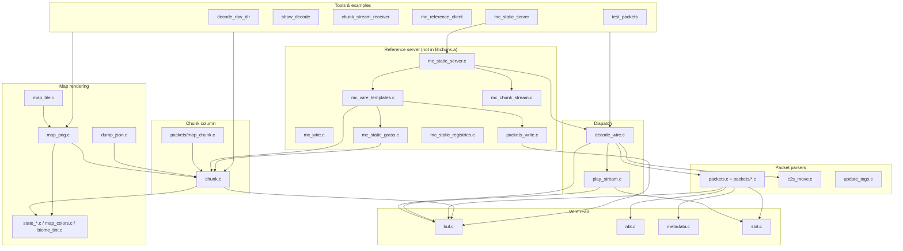

# libchunk/src call graph

Overview of how `libchunk/src` modules call each other and who uses them from `examples/` and `test/`. Per-function `/* Good for: … Callers: … */` blocks live in the `.c` files. Descriptions come from `scripts/libchunk_purposes.py` (hand-written) plus prefix rules in `annotate_libchunk_src.py` — not from spacing out the function name. `Callers` is a flat list of `.c` basenames. Regenerate with:

```bash
cd libchunk && python3 scripts/annotate_libchunk_src.py --force --report-missing
```

## Layer diagram



## Entry points (public API)

| Symbol | Module | Used by |
|--------|--------|---------|
| `lc_skip_packet_id` | `buf.c` | All decoders; `decode_wire`; examples with raw wire |
| `lc_parse_*` | `packets/*.c`, `packets.c`, `c2s_move.c`, `update_tags.c` | `decode_wire.c`, `mc_s2c_log.c`, `mc_c2s_log.c`, `mc_static_server.c`, tests |
| `lc_decode_wire_to_string` | `decode_wire.c` | `decode_raw_dir`, `mc_reference_client` |
| `lc_chunk_from_map_chunk` / `apply_*` / `to_map_chunk` | `chunk.c` | Map tools, `mc_wire_templates`, grass builder |
| `lc_map_chunk_write_top_png` / `lc_chunk_*` map helpers | `map_png.c` | `decode_raw_dir`, `chunk_stream_receiver`, `stitch_megatiles` |
| `lc_map_chunk_dump_json` | `dump_json.c` | `decode_raw_dir` |

Full list: `include/libchunk.h`, `include/decode_wire.h`.

## Decode path (capture → text)

```
wire bytes (+ optional packet id)
  → lc_skip_packet_id()          [buf.c]
  → lc_parse_<name>()            [packets/*.c]
  → lc_<name>_to_string()        [debug.c, packet files]
```

`decode_wire.c` centralizes name → parser → toString. Unsupported names may go to `play_stream.c` (`lc_decode_play_stream_to_string`).

## Chunk merge path

```
map_chunk wire
  → lc_parse_map_chunk()         [packets/map_chunk.c]
  → lc_chunk_from_map_chunk()    [chunk.c]
  → lc_chunk_apply_update_light / block_change / multi_block_change
  → lc_chunk_build_heightmaps()  [optional, after edits]
  → lc_chunk_render_top_rgb / write_top_png / fill_map_surface
```

Encoding back: `lc_chunk_to_map_chunk()` → `lc_write_map_chunk()` (`packets_write.c`, server tools only).

## Static reference server path

```
mc_static_server_start()
  → per-client thread: handle_client()     [mc_static_server.c]
      → mc_static_send_config_preamble()   [mc_static_config.c]
      → mc_static_send_registry_sync()     [mc_static_registries.c]
      → mc_template_send_config_sequence() [mc_wire_templates.c]
      → mc_template_send_play_join()
      → mc_chunk_stream_on_move()          [mc_chunk_stream.c]
          → mc_template_send_map_chunk_at / unload
      → mc_log_c2s_play / mc_log_s2c_play  [mc_c2s_log.c, mc_s2c_log.c]
      → lc_parse_c2s_* for movement
```

Grass flat world: `mc_static_build_grass_chunk()` → `lc_write_map_chunk()` in templates.

## Module → depends on

| Module | Role | Calls (main) |
|--------|------|----------------|
| `buf.c` | Varint/string/buffer reads | — |
| `nbt.c` | Anonymous NBT read/skip/print | `buf.c` |
| `metadata.c` | Entity metadata loop | `buf.c`, `slot.c` |
| `slot.c` | 1.21 item components | `buf.c` |
| `packets.c` | Shared spawn_info, heightmaps, attribute tables | `buf.c`, `nbt.c` |
| `packets/*.c` | One play packet each | `buf.c`, `packets.c` helpers |
| `debug.c` | toString / fprint for most packets | parsers, `buf.c` |
| `chunk.c` | Paletted section merge/encode | `buf.c`, `state_top_rgb.c` |
| `decode_wire.c` | Name dispatch | all `lc_parse_*`, `play_stream` |
| `play_stream.c` | Extra play packets | `buf.c`, `slot.c` |
| `map_png.c` | PNG + top-down RGB | `chunk.c`, `state_*.c`, `biome_tint.c` |
| `map_tile.c` | 16×16 chunk tiles | `map_png.c`, `map_avif.c` |
| `dump_json.c` | Full JSON map_chunk | `chunk.c`, `nbt.c` |
| `packets_write.c` | Encode S2C payloads | `mc_wire.c`, `buf.c` patterns |
| `mc_wire.c` | Growable outbound buffer | — |
| `mc_wire_templates.c` | Join/login/chunk templates | `packets_write`, `mc_static_grass` |
| `mc_chunk_stream.c` | View distance chunk ring | `mc_wire_templates` |
| `mc_static_server.c` | TCP server loop | templates, stream, logs, `lc_parse_c2s_*` |

Generated data only (no logic callers): `state_map_color.c`, `state_block_name.c`, `state_top_rgb.c`, `biome_tint.c`, `mc_static_registries_data.c`.

## Build split

- **`build/libchunk.a`**: everything in `Makefile` `SRC` (parsers, chunk, maps, decode_wire, …).
- **Linked separately** with examples: `mc_*.c` (static server, spectator, wire templates, logs).

## Regenerating function comments

```bash
cd libchunk && python3 scripts/annotate_libchunk_src.py
```

Skips functions that already have a `/* … */` block immediately above the definition.
