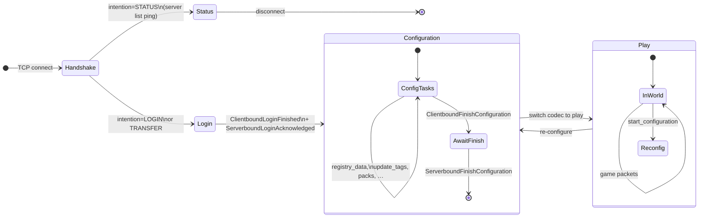
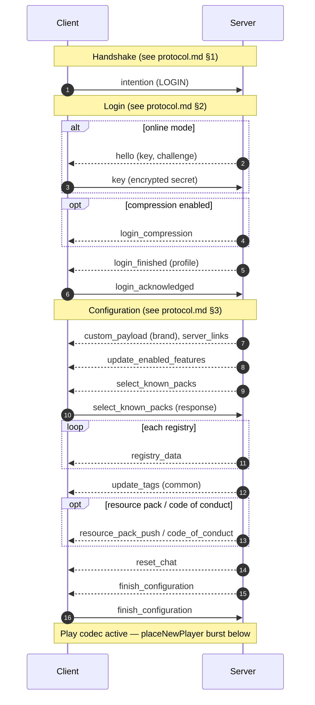
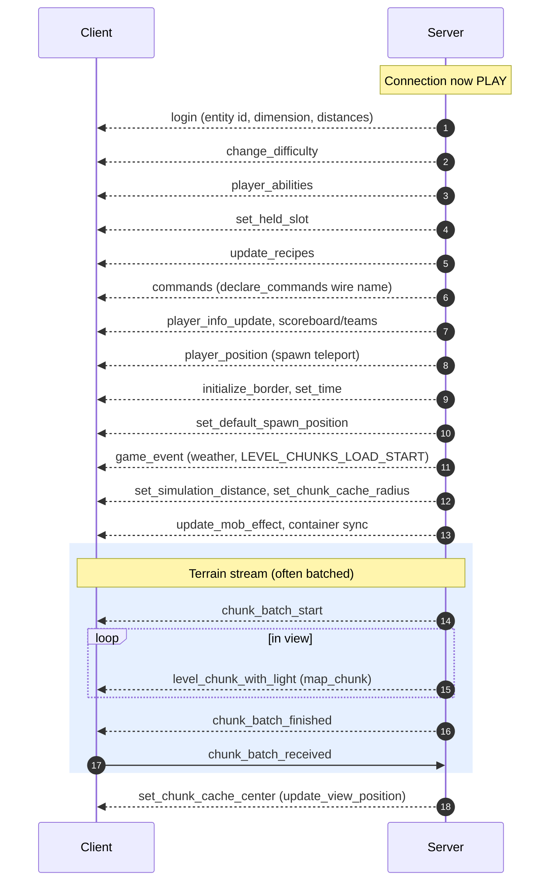

# Wire packet reference

Reference for **Minecraft Java 1.21.10** clientbound packets: connection flow, full catalog (149 packets), and libchunk / flayerproxy wire names.

Vanilla paths are relative to `net/minecraft/` in your local decompiled client tree.

## Table of contents

1. [Source locations](#source-locations)
2. [Connection protocol state machine](#connection-protocol-state-machine)
3. [Initialization flow (entering play)](#initialization-flow-entering-play)
4. [Complete clientbound catalog](#complete-clientbound-catalog) (149 packets)
5. [libchunk `PACKET_NAMES` (detail)](#libchunk-packet_names-detail)
6. [Naming notes](#naming-notes)
7. [Completeness summary](#completeness-summary)

---

## Source locations

| What | Path |
|------|------|
| Vanilla client root | `net/minecraft/` |
| Handshake (serverbound only) | [`HandshakePacketTypes.java`](net/minecraft/network/protocol/handshake/HandshakePacketTypes.java) |
| Login | [`LoginPacketTypes.java`](net/minecraft/network/protocol/login/LoginPacketTypes.java) |
| Cookie | [`CookiePacketTypes.java`](net/minecraft/network/protocol/cookie/CookiePacketTypes.java) |
| Configuration | [`ConfigurationPacketTypes.java`](net/minecraft/network/protocol/configuration/ConfigurationPacketTypes.java) |
| Common (all phases) | [`CommonPacketTypes.java`](net/minecraft/network/protocol/common/CommonPacketTypes.java) |
| Play | [`GamePacketTypes.java`](net/minecraft/network/protocol/game/GamePacketTypes.java) |
| Status (server list ping) | [`StatusPacketTypes.java`](net/minecraft/network/protocol/status/StatusPacketTypes.java) |
| libchunk decoders | [`decode_wire.c`](../src/decode_wire.c), [`play_stream.c`](../src/play_stream.c) |
| Wire path / sniffer names | [`wirePath.js`](../js/wirePath.js), [`chunkStream.js`](../../src/sniffer/chunkStream.js) |
| Vanilla join flow (server) | [protocol.md](../../protocol.md) §1–4 |

**libchunk decode:** `full` = `decode_wire.c` / `packets.c`; `partial` / `summary` = `play_stream.c`; `—` = not decoded.

---

## Connection protocol state machine

The client connection moves through **handshake → login → configuration → play**. Common packets (`keep_alive`, `disconnect`, `custom_payload`, …) are valid in login, configuration, and play. Play can return to configuration via `start_configuration`.

| Phase | Clientbound packet registries | Count |
|-------|------------------------------|------:|
| Login | `LoginPacketTypes` | 5 |
| Cookie | `CookiePacketTypes` | 1 |
| Configuration | `ConfigurationPacketTypes` + common | 6 + shared |
| Common | `CommonPacketTypes` (used in login/config/play) | 13 |
| Play | `GamePacketTypes` | 123 |
| Status | `StatusPacketTypes` (ping only) | 1 |
| **Total unique clientbound** | | **149** |

Handshake has **no** clientbound packets (`ClientIntentionPacket` is serverbound).

---

## Initialization flow (entering play)

### End-to-end: socket open → play state

### Play-state join burst (`PlayerList.placeNewPlayer`)

Typical **first packets after entering play** (order varies by server/mod). Matches [protocol.md §4](../../protocol.md#4-play-state-transition-initial-world-sync).

After this burst, the server continues with **live sync** (entities, block changes, chat, sounds). See [protocol.md §5](../../protocol.md#5-live-world-synchronization-mechanisms).

---

## Complete clientbound catalog

**149** clientbound types from all `createClientbound(...)` registrations (1.21.10).

| Column | Meaning |
|--------|---------|
| **Wire name** | flayerproxy / minecraft-protocol label when it differs from vanilla id (`—` = same as vanilla or not used) |
| **PACKET_NAMES** | ✓ if listed in [`wirePath.js`](../js/wirePath.js) |
| **libchunk** | Decode support (`full` / `partial` / `summary` / —) |

### Login (5)

| Vanilla id | Class | Wire name | PKt | libchunk | Purpose |
|------------|--------|-----------|:---:|:--------:|---------|
| `custom_query` | [ClientboundCustomQueryPacket](net/minecraft/network/protocol/login/ClientboundCustomQueryPacket.java) | — |  | — | Login plugin channel query. |
| `login_finished` | [ClientboundLoginFinishedPacket](net/minecraft/network/protocol/login/ClientboundLoginFinishedPacket.java) | — |  | — | Login done; ack → configuration. |
| `hello` | [ClientboundHelloPacket](net/minecraft/network/protocol/login/ClientboundHelloPacket.java) | — |  | — | Auth challenge + RSA public key. |
| `login_compression` | [ClientboundLoginCompressionPacket](net/minecraft/network/protocol/login/ClientboundLoginCompressionPacket.java) | — |  | — | Compression threshold. |
| `login_disconnect` | [ClientboundLoginDisconnectPacket](net/minecraft/network/protocol/login/ClientboundLoginDisconnectPacket.java) | — |  | — | Login disconnect. |

### Cookie (1)

| Vanilla id | Class | Wire name | PKt | libchunk | Purpose |
|------------|--------|-----------|:---:|:--------:|---------|
| `cookie_request` | [ClientboundCookieRequestPacket](net/minecraft/network/protocol/cookie/ClientboundCookieRequestPacket.java) | — |  | — | Request stored cookie. |

### Configuration (6)

| Vanilla id | Class | Wire name | PKt | libchunk | Purpose |
|------------|--------|-----------|:---:|:--------:|---------|
| `code_of_conduct` | [ClientboundCodeOfConductPacket](net/minecraft/network/protocol/configuration/ClientboundCodeOfConductPacket.java) | — |  | — | Code of conduct prompt. |
| `finish_configuration` | [ClientboundFinishConfigurationPacket](net/minecraft/network/protocol/configuration/ClientboundFinishConfigurationPacket.java) | — |  | — | Config done; ack → play. |
| `registry_data` | [ClientboundRegistryDataPacket](net/minecraft/network/protocol/configuration/ClientboundRegistryDataPacket.java) | `registry_data` | ✓ | full | Registry entries. |
| `reset_chat` | [ClientboundResetChatPacket](net/minecraft/network/protocol/configuration/ClientboundResetChatPacket.java) | — |  | — | Reset chat before play. |
| `select_known_packs` | [ClientboundSelectKnownPacks](net/minecraft/network/protocol/configuration/ClientboundSelectKnownPacks.java) | — |  | — | Select data packs. |
| `update_enabled_features` | [ClientboundUpdateEnabledFeaturesPacket](net/minecraft/network/protocol/configuration/ClientboundUpdateEnabledFeaturesPacket.java) | — |  | — | Feature flags. |

### Common (13)

| Vanilla id | Class | Wire name | PKt | libchunk | Purpose |
|------------|--------|-----------|:---:|:--------:|---------|
| `clear_dialog` | [ClientboundClearDialogPacket](net/minecraft/network/protocol/common/ClientboundClearDialogPacket.java) | — |  | — | Clear dialog UI. |
| `custom_payload` | [ClientboundCustomPayloadPacket](net/minecraft/network/protocol/common/ClientboundCustomPayloadPacket.java) | — |  | — | Plugin payload (e.g. brand). |
| `custom_report_details` | [ClientboundCustomReportDetailsPacket](net/minecraft/network/protocol/common/ClientboundCustomReportDetailsPacket.java) | — |  | — | Chat reporting details. |
| `disconnect` | [ClientboundDisconnectPacket](net/minecraft/network/protocol/common/ClientboundDisconnectPacket.java) | — |  | — | Disconnect with reason. |
| `keep_alive` | [ClientboundKeepAlivePacket](net/minecraft/network/protocol/common/ClientboundKeepAlivePacket.java) | — |  | — | Keep-alive id. |
| `ping` | [ClientboundPingPacket](net/minecraft/network/protocol/common/ClientboundPingPacket.java) | — |  | — | Latency measure. |
| `resource_pack_pop` | [ClientboundResourcePackPopPacket](net/minecraft/network/protocol/common/ClientboundResourcePackPopPacket.java) | — |  | — | Remove resource pack. |
| `resource_pack_push` | [ClientboundResourcePackPushPacket](net/minecraft/network/protocol/common/ClientboundResourcePackPushPacket.java) | — |  | — | Resource pack offer. |
| `server_links` | [ClientboundServerLinksPacket](net/minecraft/network/protocol/common/ClientboundServerLinksPacket.java) | — |  | — | Server link buttons. |
| `show_dialog` | [ClientboundShowDialogPacket](net/minecraft/network/protocol/common/ClientboundShowDialogPacket.java) | — |  | — | Show dialog UI. |
| `store_cookie` | [ClientboundStoreCookiePacket](net/minecraft/network/protocol/common/ClientboundStoreCookiePacket.java) | — |  | — | Store cookie on client. |
| `transfer` | [ClientboundTransferPacket](net/minecraft/network/protocol/common/ClientboundTransferPacket.java) | — |  | — | Transfer to another host. |
| `update_tags` | [ClientboundUpdateTagsPacket](net/minecraft/network/protocol/common/ClientboundUpdateTagsPacket.java) | `tags` | ✓ | partial | Tag membership per registry. |

### Play (123)

| Vanilla id | Class | Wire name | PKt | libchunk | Purpose |
|------------|--------|-----------|:---:|:--------:|---------|
| `bundle` | [ClientboundBundlePacket](net/minecraft/network/protocol/game/ClientboundBundlePacket.java) | — |  | — | Atomic batch of sub-packets. |
| `bundle_delimiter` | [ClientboundBundleDelimiterPacket](net/minecraft/network/protocol/game/ClientboundBundleDelimiterPacket.java) | — |  | — | Bundle framing marker. |
| `add_entity` | [ClientboundAddEntityPacket](net/minecraft/network/protocol/game/ClientboundAddEntityPacket.java) | `spawn_entity` | ✓ | full | Spawn entity. |
| `animate` | [ClientboundAnimatePacket](net/minecraft/network/protocol/game/ClientboundAnimatePacket.java) | — |  | — | Entity animation. |
| `award_stats` | [ClientboundAwardStatsPacket](net/minecraft/network/protocol/game/ClientboundAwardStatsPacket.java) | — |  | — | Statistics. |
| `block_changed_ack` | [ClientboundBlockChangedAckPacket](net/minecraft/network/protocol/game/ClientboundBlockChangedAckPacket.java) | — |  | — | Block prediction sequence ack. |
| `block_destruction` | [ClientboundBlockDestructionPacket](net/minecraft/network/protocol/game/ClientboundBlockDestructionPacket.java) | — |  | — | Break crack overlay. |
| `block_entity_data` | [ClientboundBlockEntityDataPacket](net/minecraft/network/protocol/game/ClientboundBlockEntityDataPacket.java) | `tile_entity_data` | ✓ | full | Block entity NBT. |
| `block_event` | [ClientboundBlockEventPacket](net/minecraft/network/protocol/game/ClientboundBlockEventPacket.java) | — |  | — | Block action event. |
| `block_update` | [ClientboundBlockUpdatePacket](net/minecraft/network/protocol/game/ClientboundBlockUpdatePacket.java) | `block_change` | ✓ | full | One block. |
| `boss_event` | [ClientboundBossEventPacket](net/minecraft/network/protocol/game/ClientboundBossEventPacket.java) | `boss_bar` | ✓ | summary | Boss bar. |
| `change_difficulty` | [ClientboundChangeDifficultyPacket](net/minecraft/network/protocol/game/ClientboundChangeDifficultyPacket.java) | `difficulty` | ✓ | partial | Difficulty. |
| `chunk_batch_finished` | [ClientboundChunkBatchFinishedPacket](net/minecraft/network/protocol/game/ClientboundChunkBatchFinishedPacket.java) | — |  | — | Chunk batch end. |
| `chunk_batch_start` | [ClientboundChunkBatchStartPacket](net/minecraft/network/protocol/game/ClientboundChunkBatchStartPacket.java) | — |  | — | Chunk batch start. |
| `chunks_biomes` | [ClientboundChunksBiomesPacket](net/minecraft/network/protocol/game/ClientboundChunksBiomesPacket.java) | — |  | — | Biome patch for chunks. |
| `clear_titles` | [ClientboundClearTitlesPacket](net/minecraft/network/protocol/game/ClientboundClearTitlesPacket.java) | — |  | — | Clear titles. |
| `command_suggestions` | [ClientboundCommandSuggestionsPacket](net/minecraft/network/protocol/game/ClientboundCommandSuggestionsPacket.java) | — |  | — | Command suggestions. |
| `commands` | [ClientboundCommandsPacket](net/minecraft/network/protocol/game/ClientboundCommandsPacket.java) | `declare_commands` | ✓ | summary | Command tree. |
| `container_close` | [ClientboundContainerClosePacket](net/minecraft/network/protocol/game/ClientboundContainerClosePacket.java) | — |  | — | Close menu. |
| `container_set_content` | [ClientboundContainerSetContentPacket](net/minecraft/network/protocol/game/ClientboundContainerSetContentPacket.java) | `window_items` | ✓ | partial | Container contents. |
| `container_set_data` | [ClientboundContainerSetDataPacket](net/minecraft/network/protocol/game/ClientboundContainerSetDataPacket.java) | — |  | — | Container property int. |
| `container_set_slot` | [ClientboundContainerSetSlotPacket](net/minecraft/network/protocol/game/ClientboundContainerSetSlotPacket.java) | `set_slot` | ✓ | partial | One slot. |
| `cooldown` | [ClientboundCooldownPacket](net/minecraft/network/protocol/game/ClientboundCooldownPacket.java) | — |  | — | Item cooldown. |
| `custom_chat_completions` | [ClientboundCustomChatCompletionsPacket](net/minecraft/network/protocol/game/ClientboundCustomChatCompletionsPacket.java) | — |  | — | Tab completions. |
| `damage_event` | [ClientboundDamageEventPacket](net/minecraft/network/protocol/game/ClientboundDamageEventPacket.java) | — |  | — | Damage presentation. |
| `debug/block_value` | [ClientboundDebugBlockValuePacket](net/minecraft/network/protocol/game/ClientboundDebugBlockValuePacket.java) | — |  | — | Debug block value. |
| `debug/chunk_value` | [ClientboundDebugChunkValuePacket](net/minecraft/network/protocol/game/ClientboundDebugChunkValuePacket.java) | — |  | — | Debug chunk value. |
| `debug/entity_value` | [ClientboundDebugEntityValuePacket](net/minecraft/network/protocol/game/ClientboundDebugEntityValuePacket.java) | — |  | — | Debug entity value. |
| `debug/event` | [ClientboundDebugEventPacket](net/minecraft/network/protocol/game/ClientboundDebugEventPacket.java) | — |  | — | Debug event. |
| `debug_sample` | [ClientboundDebugSamplePacket](net/minecraft/network/protocol/game/ClientboundDebugSamplePacket.java) | — |  | — | Debug perf sample. |
| `delete_chat` | [ClientboundDeleteChatPacket](net/minecraft/network/protocol/game/ClientboundDeleteChatPacket.java) | — |  | — | Remove chat message. |
| `disguised_chat` | [ClientboundDisguisedChatPacket](net/minecraft/network/protocol/game/ClientboundDisguisedChatPacket.java) | — |  | — | Disguised chat. |
| `entity_event` | [ClientboundEntityEventPacket](net/minecraft/network/protocol/game/ClientboundEntityEventPacket.java) | `entity_status` | ✓ | partial | Status byte. |
| `entity_position_sync` | [ClientboundEntityPositionSyncPacket](net/minecraft/network/protocol/game/ClientboundEntityPositionSyncPacket.java) | `sync_entity_position` | ✓ | full | Position sync. |
| `explode` | [ClientboundExplodePacket](net/minecraft/network/protocol/game/ClientboundExplodePacket.java) | — |  | — | Explosion FX/knockback. |
| `forget_level_chunk` | [ClientboundForgetLevelChunkPacket](net/minecraft/network/protocol/game/ClientboundForgetLevelChunkPacket.java) | `unload_chunk` | ✓ | full | Unload chunk. |
| `game_event` | [ClientboundGameEventPacket](net/minecraft/network/protocol/game/ClientboundGameEventPacket.java) | `game_state_change` | ✓ | partial | Game events. |
| `game_test_highlight_pos` | [ClientboundGameTestHighlightPosPacket](net/minecraft/network/protocol/game/ClientboundGameTestHighlightPosPacket.java) | — |  | — | Game-test highlights. |
| `horse_screen_open` | [ClientboundHorseScreenOpenPacket](net/minecraft/network/protocol/game/ClientboundHorseScreenOpenPacket.java) | — |  | — | Horse inventory. |
| `hurt_animation` | [ClientboundHurtAnimationPacket](net/minecraft/network/protocol/game/ClientboundHurtAnimationPacket.java) | — |  | — | Hurt flash. |
| `initialize_border` | [ClientboundInitializeBorderPacket](net/minecraft/network/protocol/game/ClientboundInitializeBorderPacket.java) | `initialize_world_border` | ✓ | full | World border init. |
| `level_chunk_with_light` | [ClientboundLevelChunkWithLightPacket](net/minecraft/network/protocol/game/ClientboundLevelChunkWithLightPacket.java) | `map_chunk` | ✓ | full | Chunk + light. |
| `level_event` | [ClientboundLevelEventPacket](net/minecraft/network/protocol/game/ClientboundLevelEventPacket.java) | — |  | — | World effect. |
| `level_particles` | [ClientboundLevelParticlesPacket](net/minecraft/network/protocol/game/ClientboundLevelParticlesPacket.java) | — |  | — | Particles. |
| `light_update` | [ClientboundLightUpdatePacket](net/minecraft/network/protocol/game/ClientboundLightUpdatePacket.java) | `update_light` | ✓ | full | Light update. |
| `login` | [ClientboundLoginPacket](net/minecraft/network/protocol/game/ClientboundLoginPacket.java) | — |  | — | Play join params. |
| `map_item_data` | [ClientboundMapItemDataPacket](net/minecraft/network/protocol/game/ClientboundMapItemDataPacket.java) | — |  | — | Map pixels. |
| `merchant_offers` | [ClientboundMerchantOffersPacket](net/minecraft/network/protocol/game/ClientboundMerchantOffersPacket.java) | — |  | — | Villager trades. |
| `move_entity_pos` | [ClientboundMoveEntityPacket.Pos](net/minecraft/network/protocol/game/ClientboundMoveEntityPacket.Pos.java) | `rel_entity_move` | ✓ | full | Relative move. |
| `move_entity_pos_rot` | [ClientboundMoveEntityPacket.PosRot](net/minecraft/network/protocol/game/ClientboundMoveEntityPacket.PosRot.java) | `entity_move_look` | ✓ | full | Move + look. |
| `move_minecart_along_track` | [ClientboundMoveMinecartPacket](net/minecraft/network/protocol/game/ClientboundMoveMinecartPacket.java) | — |  | — | Minecart rail steps. |
| `move_entity_rot` | [ClientboundMoveEntityPacket.Rot](net/minecraft/network/protocol/game/ClientboundMoveEntityPacket.Rot.java) | `entity_look` | ✓ | partial | Rotation only. |
| `move_vehicle` | [ClientboundMoveVehiclePacket](net/minecraft/network/protocol/game/ClientboundMoveVehiclePacket.java) | — |  | — | Vehicle resync. |
| `open_book` | [ClientboundOpenBookPacket](net/minecraft/network/protocol/game/ClientboundOpenBookPacket.java) | — |  | — | Written book UI. |
| `open_screen` | [ClientboundOpenScreenPacket](net/minecraft/network/protocol/game/ClientboundOpenScreenPacket.java) | — |  | — | Open GUI. |
| `open_sign_editor` | [ClientboundOpenSignEditorPacket](net/minecraft/network/protocol/game/ClientboundOpenSignEditorPacket.java) | — |  | — | Sign editor. |
| `place_ghost_recipe` | [ClientboundPlaceGhostRecipePacket](net/minecraft/network/protocol/game/ClientboundPlaceGhostRecipePacket.java) | — |  | — | Recipe ghost preview. |
| `player_abilities` | [ClientboundPlayerAbilitiesPacket](net/minecraft/network/protocol/game/ClientboundPlayerAbilitiesPacket.java) | `abilities` | ✓ | partial | Abilities. |
| `player_chat` | [ClientboundPlayerChatPacket](net/minecraft/network/protocol/game/ClientboundPlayerChatPacket.java) | — |  | — | Signed player chat. |
| `player_combat_end` | [ClientboundPlayerCombatEndPacket](net/minecraft/network/protocol/game/ClientboundPlayerCombatEndPacket.java) | — |  | — | Legacy (no-op). |
| `player_combat_enter` | [ClientboundPlayerCombatEnterPacket](net/minecraft/network/protocol/game/ClientboundPlayerCombatEnterPacket.java) | — |  | — | Legacy (no-op). |
| `player_combat_kill` | [ClientboundPlayerCombatKillPacket](net/minecraft/network/protocol/game/ClientboundPlayerCombatKillPacket.java) | — |  | — | Death screen. |
| `player_info_remove` | [ClientboundPlayerInfoRemovePacket](net/minecraft/network/protocol/game/ClientboundPlayerInfoRemovePacket.java) | `player_remove` | ✓ | summary | Tab list remove. |
| `player_info_update` | [ClientboundPlayerInfoUpdatePacket](net/minecraft/network/protocol/game/ClientboundPlayerInfoUpdatePacket.java) | `player_info` | ✓ | partial | Tab list update. |
| `player_look_at` | [ClientboundPlayerLookAtPacket](net/minecraft/network/protocol/game/ClientboundPlayerLookAtPacket.java) | — |  | — | Force look target. |
| `player_position` | [ClientboundPlayerPositionPacket](net/minecraft/network/protocol/game/ClientboundPlayerPositionPacket.java) | `position` | ✓ | full | Player move. |
| `player_rotation` | [ClientboundPlayerRotationPacket](net/minecraft/network/protocol/game/ClientboundPlayerRotationPacket.java) | — |  | — | Player yaw/pitch. |
| `recipe_book_add` | [ClientboundRecipeBookAddPacket](net/minecraft/network/protocol/game/ClientboundRecipeBookAddPacket.java) | `recipe_book_add` | ✓ | summary | Recipe book add. |
| `recipe_book_remove` | [ClientboundRecipeBookRemovePacket](net/minecraft/network/protocol/game/ClientboundRecipeBookRemovePacket.java) | — |  | — | Remove recipes. |
| `recipe_book_settings` | [ClientboundRecipeBookSettingsPacket](net/minecraft/network/protocol/game/ClientboundRecipeBookSettingsPacket.java) | `recipe_book_settings` | ✓ | summary | Recipe book settings. |
| `remove_entities` | [ClientboundRemoveEntitiesPacket](net/minecraft/network/protocol/game/ClientboundRemoveEntitiesPacket.java) | `entity_destroy` | ✓ | full | Remove entities. |
| `remove_mob_effect` | [ClientboundRemoveMobEffectPacket](net/minecraft/network/protocol/game/ClientboundRemoveMobEffectPacket.java) | `remove_entity_effect` | ✓ | partial | Remove effect. |
| `respawn` | [ClientboundRespawnPacket](net/minecraft/network/protocol/game/ClientboundRespawnPacket.java) | — |  | — | Respawn/dimension. |
| `rotate_head` | [ClientboundRotateHeadPacket](net/minecraft/network/protocol/game/ClientboundRotateHeadPacket.java) | `entity_head_rotation` | ✓ | full | Head yaw. |
| `section_blocks_update` | [ClientboundSectionBlocksUpdatePacket](net/minecraft/network/protocol/game/ClientboundSectionBlocksUpdatePacket.java) | `multi_block_change` | ✓ | full | Section block batch. |
| `select_advancements_tab` | [ClientboundSelectAdvancementsTabPacket](net/minecraft/network/protocol/game/ClientboundSelectAdvancementsTabPacket.java) | — |  | — | Advancements tab. |
| `server_data` | [ClientboundServerDataPacket](net/minecraft/network/protocol/game/ClientboundServerDataPacket.java) | — |  | — | Server branding. |
| `set_action_bar_text` | [ClientboundSetActionBarTextPacket](net/minecraft/network/protocol/game/ClientboundSetActionBarTextPacket.java) | — |  | — | Action bar. |
| `set_border_center` | [ClientboundSetBorderCenterPacket](net/minecraft/network/protocol/game/ClientboundSetBorderCenterPacket.java) | `world_border_center` | ✓ | partial | Border center. |
| `set_border_lerp_size` | [ClientboundSetBorderLerpSizePacket](net/minecraft/network/protocol/game/ClientboundSetBorderLerpSizePacket.java) | `world_border_lerp_size` | ✓ | partial | Border lerp. |
| `set_border_size` | [ClientboundSetBorderSizePacket](net/minecraft/network/protocol/game/ClientboundSetBorderSizePacket.java) | `world_border_size` | ✓ | partial | Border size. |
| `set_border_warning_delay` | [ClientboundSetBorderWarningDelayPacket](net/minecraft/network/protocol/game/ClientboundSetBorderWarningDelayPacket.java) | `world_border_warning_delay` | ✓ | partial | Border warn delay. |
| `set_camera` | [ClientboundSetCameraPacket](net/minecraft/network/protocol/game/ClientboundSetCameraPacket.java) | — |  | — | Spectator camera entity. |
| `set_chunk_cache_center` | [ClientboundSetChunkCacheCenterPacket](net/minecraft/network/protocol/game/ClientboundSetChunkCacheCenterPacket.java) | `update_view_position` | ✓ | partial | View center. |
| `set_chunk_cache_radius` | [ClientboundSetChunkCacheRadiusPacket](net/minecraft/network/protocol/game/ClientboundSetChunkCacheRadiusPacket.java) | `update_view_distance` | ✓ | partial | View distance. |
| `set_display_objective` | [ClientboundSetDisplayObjectivePacket](net/minecraft/network/protocol/game/ClientboundSetDisplayObjectivePacket.java) | `scoreboard_display_objective` | ✓ | partial | Display slot. |
| `set_entity_data` | [ClientboundSetEntityDataPacket](net/minecraft/network/protocol/game/ClientboundSetEntityDataPacket.java) | `entity_metadata` | ✓ | full | Entity metadata. |
| `set_entity_link` | [ClientboundSetEntityLinkPacket](net/minecraft/network/protocol/game/ClientboundSetEntityLinkPacket.java) | — |  | — | Leash link. |
| `set_entity_motion` | [ClientboundSetEntityMotionPacket](net/minecraft/network/protocol/game/ClientboundSetEntityMotionPacket.java) | `entity_velocity` | ✓ | full | Velocity. |
| `set_equipment` | [ClientboundSetEquipmentPacket](net/minecraft/network/protocol/game/ClientboundSetEquipmentPacket.java) | `entity_equipment` | ✓ | full | Equipment. |
| `set_experience` | [ClientboundSetExperiencePacket](net/minecraft/network/protocol/game/ClientboundSetExperiencePacket.java) | `experience` | ✓ | partial | XP. |
| `set_health` | [ClientboundSetHealthPacket](net/minecraft/network/protocol/game/ClientboundSetHealthPacket.java) | `update_health` | ✓ | partial | Health/food. |
| `set_held_slot` | [ClientboundSetHeldSlotPacket](net/minecraft/network/protocol/game/ClientboundSetHeldSlotPacket.java) | `held_item_slot` | ✓ | partial | Hotbar slot. |
| `set_objective` | [ClientboundSetObjectivePacket](net/minecraft/network/protocol/game/ClientboundSetObjectivePacket.java) | `scoreboard_objective` | ✓ | summary | Objective. |
| `set_passengers` | [ClientboundSetPassengersPacket](net/minecraft/network/protocol/game/ClientboundSetPassengersPacket.java) | — |  | — | Passengers. |
| `set_player_team` | [ClientboundSetPlayerTeamPacket](net/minecraft/network/protocol/game/ClientboundSetPlayerTeamPacket.java) | `teams` | ✓ | summary | Team. |
| `set_score` | [ClientboundSetScorePacket](net/minecraft/network/protocol/game/ClientboundSetScorePacket.java) | `scoreboard_score` | ✓ | summary | Score. |
| `set_simulation_distance` | [ClientboundSetSimulationDistancePacket](net/minecraft/network/protocol/game/ClientboundSetSimulationDistancePacket.java) | `simulation_distance` | ✓ | partial | Sim distance. |
| `set_subtitle_text` | [ClientboundSetSubtitleTextPacket](net/minecraft/network/protocol/game/ClientboundSetSubtitleTextPacket.java) | — |  | — | Subtitle. |
| `set_time` | [ClientboundSetTimePacket](net/minecraft/network/protocol/game/ClientboundSetTimePacket.java) | `update_time` | ✓ | partial | World time. |
| `set_title_text` | [ClientboundSetTitleTextPacket](net/minecraft/network/protocol/game/ClientboundSetTitleTextPacket.java) | — |  | — | Title text. |
| `set_titles_animation` | [ClientboundSetTitlesAnimationPacket](net/minecraft/network/protocol/game/ClientboundSetTitlesAnimationPacket.java) | — |  | — | Title timings. |
| `sound_entity` | [ClientboundSoundEntityPacket](net/minecraft/network/protocol/game/ClientboundSoundEntityPacket.java) | — |  | — | Sound on entity. |
| `sound` | [ClientboundSoundPacket](net/minecraft/network/protocol/game/ClientboundSoundPacket.java) | — |  | — | Sound at position. |
| `start_configuration` | [ClientboundStartConfigurationPacket](net/minecraft/network/protocol/game/ClientboundStartConfigurationPacket.java) | — |  | — | Re-enter configuration. |
| `stop_sound` | [ClientboundStopSoundPacket](net/minecraft/network/protocol/game/ClientboundStopSoundPacket.java) | — |  | — | Stop sounds. |
| `system_chat` | [ClientboundSystemChatPacket](net/minecraft/network/protocol/game/ClientboundSystemChatPacket.java) | — |  | — | System chat/action bar. |
| `tab_list` | [ClientboundTabListPacket](net/minecraft/network/protocol/game/ClientboundTabListPacket.java) | `playerlist_header` | ✓ | summary | Tab header/footer. |
| `tag_query` | [ClientboundTagQueryPacket](net/minecraft/network/protocol/game/ClientboundTagQueryPacket.java) | — |  | — | Tag query NBT response. |
| `take_item_entity` | [ClientboundTakeItemEntityPacket](net/minecraft/network/protocol/game/ClientboundTakeItemEntityPacket.java) | — |  | — | Pickup effect. |
| `teleport_entity` | [ClientboundTeleportEntityPacket](net/minecraft/network/protocol/game/ClientboundTeleportEntityPacket.java) | `entity_teleport` | ✓ | partial | Teleport. |
| `test_instance_block_status` | [ClientboundTestInstanceBlockStatus](net/minecraft/network/protocol/game/ClientboundTestInstanceBlockStatus.java) | — |  | — | Test-instance UI. |
| `update_advancements` | [ClientboundUpdateAdvancementsPacket](net/minecraft/network/protocol/game/ClientboundUpdateAdvancementsPacket.java) | `advancements` | ✓ | summary | Advancements. |
| `update_attributes` | [ClientboundUpdateAttributesPacket](net/minecraft/network/protocol/game/ClientboundUpdateAttributesPacket.java) | `entity_update_attributes` | ✓ | full | Attributes. |
| `update_mob_effect` | [ClientboundUpdateMobEffectPacket](net/minecraft/network/protocol/game/ClientboundUpdateMobEffectPacket.java) | `entity_effect` | ✓ | partial | Effect. |
| `update_recipes` | [ClientboundUpdateRecipesPacket](net/minecraft/network/protocol/game/ClientboundUpdateRecipesPacket.java) | `update_recipes` | ✓ | summary | Recipes. |
| `projectile_power` | [ClientboundProjectilePowerPacket](net/minecraft/network/protocol/game/ClientboundProjectilePowerPacket.java) | — |  | — | Projectile power. |
| `waypoint` | [ClientboundTrackedWaypointPacket](net/minecraft/network/protocol/game/ClientboundTrackedWaypointPacket.java) | `tracked_waypoint` | ✓ | summary | Waypoint. |
| `reset_score` | [ClientboundResetScorePacket](net/minecraft/network/protocol/game/ClientboundResetScorePacket.java) | `reset_score` | ✓ | partial | Reset score. |
| `ticking_state` | [ClientboundTickingStatePacket](net/minecraft/network/protocol/game/ClientboundTickingStatePacket.java) | — |  | — | Tick rate/freeze. |
| `ticking_step` | [ClientboundTickingStepPacket](net/minecraft/network/protocol/game/ClientboundTickingStepPacket.java) | — |  | — | Frozen tick steps. |
| `set_cursor_item` | [ClientboundSetCursorItemPacket](net/minecraft/network/protocol/game/ClientboundSetCursorItemPacket.java) | `set_cursor_item` | ✓ | partial | Cursor item. |
| `set_player_inventory` | [ClientboundSetPlayerInventoryPacket](net/minecraft/network/protocol/game/ClientboundSetPlayerInventoryPacket.java) | `set_player_inventory` | ✓ | partial | Player inv slot. |

### Status (1)

| Vanilla id | Class | Wire name | PKt | libchunk | Purpose |
|------------|--------|-----------|:---:|:--------:|---------|
| `status_response` | [ClientboundStatusResponsePacket](net/minecraft/network/protocol/status/ClientboundStatusResponsePacket.java) | — |  | — | Server list MOTD JSON. |

---

## libchunk `PACKET_NAMES` (detail)

The **68** names in [`wirePath.js`](../js/wirePath.js) are what libchunk can decode and the wire viewer recognizes. Below: grouped reference with decode depth and parser links.

**Decode depth:** **Full** = `decode_wire.c` / `packets.c`. **Partial** / **Summary** = `play_stream.c`.

### World / chunks / blocks

| Wire name | Vanilla id | Decode | Description | libchunk |
|-----------|------------|--------|-------------|----------|
| `map_chunk` | `level_chunk_with_light` | Full | Chunk column + sky/block light. | `lc_parse_map_chunk` |
| `unload_chunk` | `forget_level_chunk` | Full | Drop chunk at X/Z. | `lc_parse_unload_chunk` |
| `update_light` | `light_update` | Full | Light masks/arrays only. | `lc_parse_update_light` |
| `block_change` | `block_update` | Full | Single block state. | `lc_parse_block_change` |
| `multi_block_change` | `section_blocks_update` | Full | Many blocks in one section. | `lc_parse_multi_block_change` |
| `tile_entity_data` | `block_entity_data` | Full | Block entity NBT. | `lc_parse_tile_entity_data` |
| `chunk_batch_start` | `chunk_batch_start` | Partial | Begin chunk batch. | `play_stream.c` |
| `chunk_batch_finished` | `chunk_batch_finished` | Partial | End chunk batch. | `play_stream.c` |

### Entities

| Wire name | Vanilla id | Decode | Description | libchunk |
|-----------|------------|--------|-------------|----------|
| `spawn_entity` | `add_entity` | Full | Spawn entity. | `lc_parse_spawn_entity` |
| `entity_destroy` | `remove_entities` | Full | Remove entity ids. | `lc_parse_entity_destroy` |
| `entity_metadata` | `set_entity_data` | Full | Entity data watcher. | `lc_parse_entity_metadata` |
| `entity_equipment` | `set_equipment` | Full | Armor/hand items. | `lc_parse_entity_equipment` |
| `set_passengers` | `set_passengers` | Full | Vehicle/passenger stack. | `lc_parse_set_passengers` |
| `rel_entity_move` | `move_entity_pos` | Full | Relative move. | `lc_parse_rel_entity_move` |
| `entity_move_look` | `move_entity_pos_rot` | Full | Move + rotation. | `lc_parse_entity_move_look` |
| `entity_look` | `move_entity_rot` | Partial | Rotation only. | `play_stream.c` |
| `sync_entity_position` | `entity_position_sync` | Full | Authoritative sync. | `lc_parse_sync_entity_position` |
| `entity_velocity` | `set_entity_motion` | Full | Velocity vector. | `lc_parse_entity_velocity` |
| `entity_head_rotation` | `rotate_head` | Full | Head yaw. | `lc_parse_entity_head_rotation` |
| `entity_update_attributes` | `update_attributes` | Full | Attributes/modifiers. | `lc_parse_entity_update_attributes` |
| `entity_teleport` | `teleport_entity` | Partial | Absolute teleport. | `play_stream.c` |
| `entity_effect` | `update_mob_effect` | Partial | Status effect. | `play_stream.c` |
| `remove_entity_effect` | `remove_mob_effect` | Partial | Remove effect. | `play_stream.c` |

### Local player

| Wire name | Vanilla id | Decode | Description | libchunk |
|-----------|------------|--------|-------------|----------|
| `login` | `login` | Partial | Play join parameters. | `play_stream.c` |
| `position` | `player_position` | Full | Move/rotate player. | `lc_parse_position` |
| `respawn` | `respawn` | Full | Respawn / dimension change. | `lc_parse_respawn` |
| `update_health` | `set_health` | Partial | Health, food, saturation. | `play_stream.c` |
| `experience` | `set_experience` | Partial | XP bar/level. | `play_stream.c` |
| `abilities` | `player_abilities` | Partial | Fly/walk speeds, flags. | `play_stream.c` |
| `entity_status` | `entity_event` | Partial | Status byte events. | `play_stream.c` |
| `spawn_position` | `set_default_spawn_position` | Partial | World spawn. | `play_stream.c` |
| `difficulty` | `change_difficulty` | Partial | Difficulty + locked. | `play_stream.c` |
| `game_state_change` | `game_event` | Partial | Rain, gamemode, chunk-load start. | `play_stream.c` |

### Inventory, world meta, UI data

| Wire name | Vanilla id | Decode | Description | libchunk |
|-----------|------------|--------|-------------|----------|
| `window_items` | `container_set_content` | Partial | Full container + cursor. | `play_stream.c` |
| `set_slot` | `container_set_slot` | Partial | One container slot. | `play_stream.c` |
| `held_item_slot` | `set_held_slot` | Partial | Hotbar selection. | `play_stream.c` |
| `set_player_inventory` | `set_player_inventory` | Partial | Player inv slot. | `play_stream.c` |
| `set_cursor_item` | `set_cursor_item` | Partial | Cursor stack. | `play_stream.c` |
| `update_time` | `set_time` | Partial | World age/time. | `play_stream.c` |
| `initialize_world_border` | `initialize_border` | Full | Full border state. | `lc_parse_initialize_world_border` |
| `world_border_*` | `set_border_*` | Partial | Border updates. | `play_stream.c` |
| `simulation_distance` | `set_simulation_distance` | Partial | Simulation radius. | `play_stream.c` |
| `update_view_distance` | `set_chunk_cache_radius` | Partial | View distance. | `play_stream.c` |
| `update_view_position` | `set_chunk_cache_center` | Partial | View center chunk. | `play_stream.c` |
| `registry_data` | `registry_data` (config) | Full | Registry sync. | `lc_parse_registry_data` |
| `declare_commands` | `commands` | Summary | Command tree. | `play_stream.c` |
| `declare_recipes` | *(legacy)* | Summary | Old wire name; no 1.21.10 play id. | `play_stream.c` |
| `update_recipes` | `update_recipes` | Summary | Recipe sets. | `play_stream.c` |
| `advancements` | `update_advancements` | Summary | Advancement sync. | `play_stream.c` |
| `recipe_book_add` | `recipe_book_add` | Summary | Recipe book entries. | `play_stream.c` |
| `recipe_book_settings` | `recipe_book_settings` | Summary | Recipe book UI. | `play_stream.c` |
| `tags` | `update_tags` (common) | Partial | Tag groups. | `play_stream.c` |
| `player_info` | `player_info_update` | Partial | Tab list update. | `play_stream.c` |
| `player_remove` | `player_info_remove` | Summary | Tab list remove. | `play_stream.c` |
| `playerlist_header` | `tab_list` | Summary | Tab header/footer. | `play_stream.c` |
| `scoreboard_*` / `teams` / `reset_score` | `set_*` / `set_player_team` | Partial/Summary | Scoreboard. | `play_stream.c` |
| `boss_bar` | `boss_event` | Summary | Boss bar. | `play_stream.c` |
| `tracked_waypoint` | `waypoint` | Summary | Waypoints. | `play_stream.c` |
| `server_data` | `server_data` | Summary | Server branding. | `play_stream.c` |

---

## Naming notes

| Wire name | Note |
|-----------|------|
| `declare_recipes` | Legacy; not in 1.21.10 `GamePacketTypes`. Use `update_recipes`. |
| `player_info` | Vanilla: `player_info_update`; removes = `player_info_remove` / wire `player_remove`. |
| `world_border_warning_reach` | Vanilla id: `set_border_warning_distance`. |
| `tags` | Vanilla: common `update_tags`, not play `tag_query`. |
| `map_chunk` | Vanilla: `level_chunk_with_light`. |

---

## Completeness summary

| Set | Count | Notes |
|-----|------:|-------|
| All clientbound (this doc) | **149** | Login 5 + cookie 1 + config 6 + common 13 + play 123 + status 1 |
| Play with `PACKET_NAMES` wire alias | **64** | Includes config/common-only names used in sniffer (`registry_data`, `tags`) |
| `PACKET_NAMES` in `wirePath.js` | **68** | Includes `declare_recipes` (legacy) |
| libchunk decodable | **68** | Matches `decode_wire.c` + `play_stream.c` |
| Play **not** in `PACKET_NAMES` | **61** | Full list in [Play catalog](#play-123) rows without ✓ |

- `registry_data` is decoded by libchunk but not in [`chunkStream.js`](../../src/sniffer/chunkStream.js) (configuration-phase).
- For server-side join logic, see [protocol.md](../../protocol.md).

