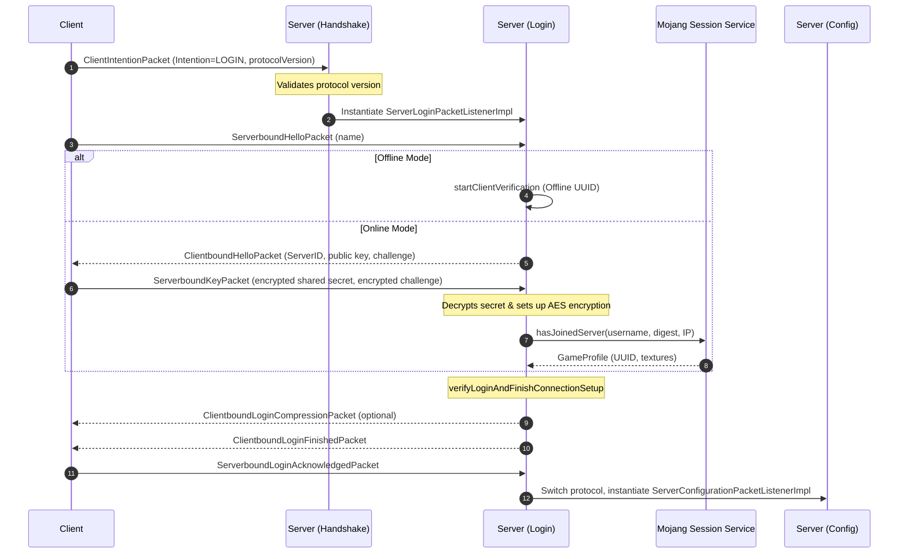
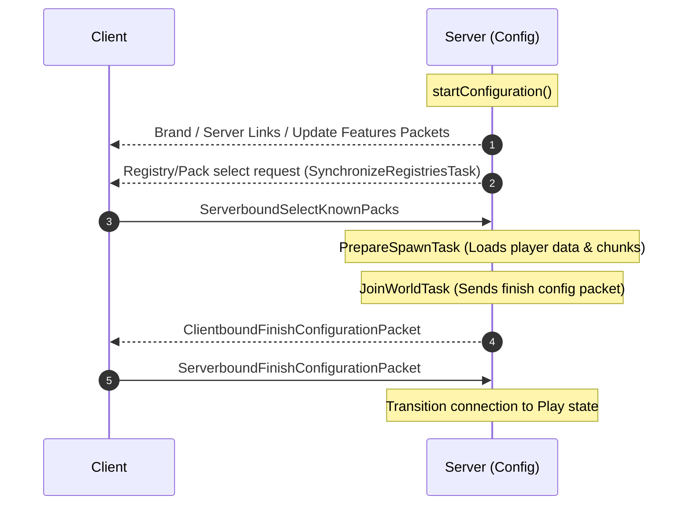
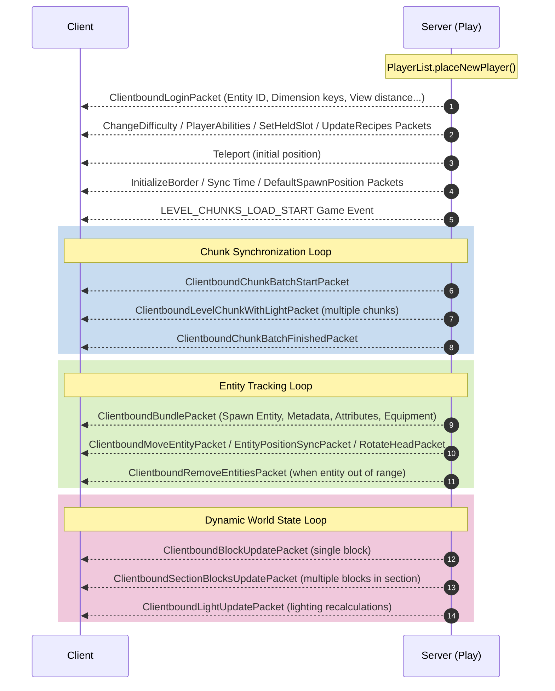
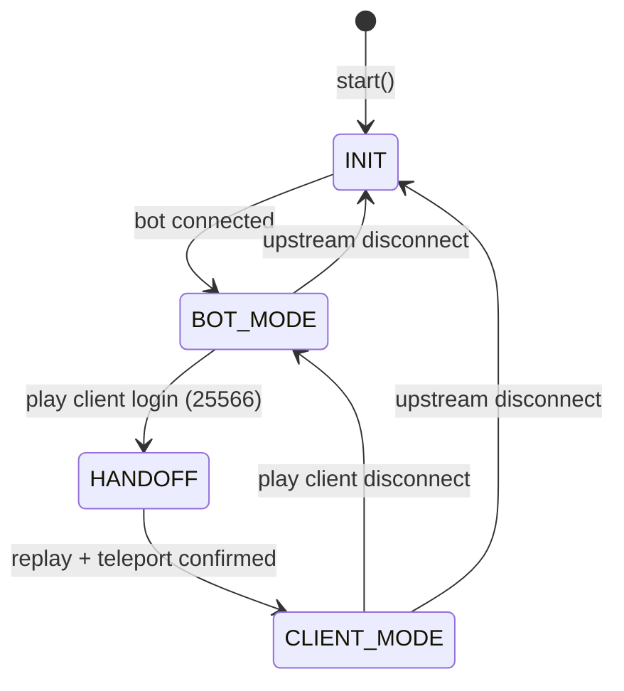
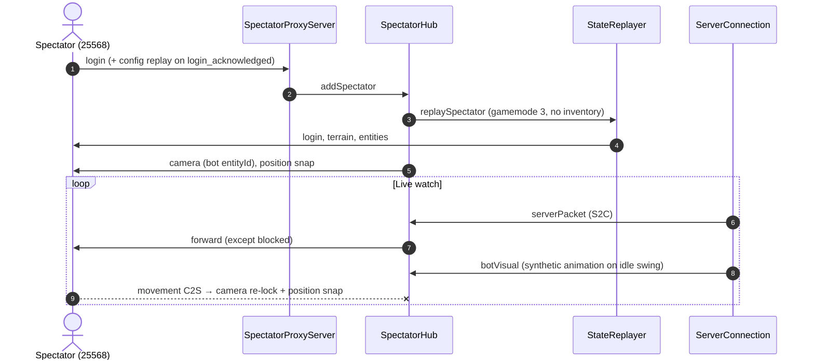

# Minecraft Protocol Reference

This document has two parts:

1. **Vanilla server** (sections 1–5) — login, configuration, and world sync as implemented in `serversSrc` (decompiled server sources).
2. **FlayerProxy** (sections 6–10) — how this project replays, caches, and forwards packets on ports **25566** (play), **25568** (spectator), and **25567** (sniffer).

For class-level file mapping, see [codebase_map.md](codebase_map.md).

---

## Table of contents

| Section | Topic |
| :--- | :--- |
| [1](#1-connection-handshake--protocol-transition) | Vanilla handshake → login |
| [2](#2-login-protocol-phase) | Vanilla login & encryption |
| [3](#3-configuration-phase) | Vanilla configuration tasks |
| [4](#4-play-state-transition-initial-world-sync) | Vanilla `placeNewPlayer` stream |
| [5](#5-live-world-synchronization-mechanisms) | Vanilla chunk / entity / block loops |
| [6](#6-flayerproxy-ports-and-session-states) | FlayerProxy ports & state machine |
| [7](#7-flayerproxy-play-handoff-port-25566) | Play client handoff & `CLIENT_MODE` bridge |
| [8](#8-flayerproxy-spectator-watch-port-25568) | Spectator replay, fan-out, filters |
| [9](#9-flayerproxy-chunk-synchronization) | Cache, replay radius, live forwarding |
| [10](#10-flayerproxy-packet-forwarding-rules) | `writeRaw`, config replay, merge notes |
| [11](#11-packet-sniffer-development) | MITM sniffer (25567) |

---

# Part I — Vanilla server (`serversSrc`)

## 1. Connection Handshake & Protocol Transition

When a client initiates a connection to a Minecraft server, it starts in the **Handshake** protocol. This is handled by [ServerHandshakePacketListenerImpl](file:///home/seb/flayerproxy/serversSrc/net/minecraft/server/network/ServerHandshakePacketListenerImpl.java).



### Protocol Steps:
1. **Client Intention**: The client sends a `ClientIntentionPacket` indicating its target state:
   - `STATUS`: The client is pinging the server for info (MOTD, online players).
   - `LOGIN`/`TRANSFER`: The client wants to connect to the game server.
2. **Version Verification**: The server verifies that the client's protocol version matches the server's current version:
   - If mismatched, the server sends a `ClientboundLoginDisconnectPacket` and closes the socket.
   - If matching, the server transitions the connection to the `Login` protocol state and spawns a [ServerLoginPacketListenerImpl](file:///home/seb/flayerproxy/serversSrc/net/minecraft/server/network/ServerLoginPacketListenerImpl.java).

---

## 2. Login Protocol Phase

The login protocol handles authentication, encryption setup, and duplicate connection handling.

### Step-by-Step Flow:
1. **Hello**: The client sends its username inside a `ServerboundHelloPacket`.
2. **Authentication Determination**:
   - **Offline Mode**: The server bypasses encryption/auth, creates an offline UUID profile, and starts verification.
   - **Online Mode**: The server transitions to the `KEY` state and sends a `ClientboundHelloPacket` containing a random challenge token, the server's public key, and server ID.
3. **Encryption Setup**:
   - The client generates a shared secret symmetric key (AES), encrypts it and the challenge token using the server's RSA public key, and sends it back in a `ServerboundKeyPacket`.
   - The server decrypts the shared secret and challenge token using its private key. It verifies the challenge matches.
   - Symmetric AES encryption is initialized on the network socket (`connection.setEncryptionKey(...)`).
4. **Session Verification**:
   - The server computes a SHA-1 hash (server ID + shared secret + server public key) and sends a request to Mojang's session servers to verify if the client has successfully authenticated their session (`hasJoinedServer`).
   - If verified, the server receives the client's official `GameProfile` (UUID, username, skin textures, etc.).
5. **Verifying and Compression**:
   - The server verifies if the player is allowed to connect (checks `UserBanList`, `IpBanList`, `UserWhiteList`, and server full limitations via `PlayerList.canPlayerLogin`).
   - If a compression threshold is configured in `server.properties`, the server sends a `ClientboundLoginCompressionPacket` and turns on network compression.
   - **Duplicate Connection Check**: The server disconnects any existing players with the same UUID.
6. **Finished Protocol Transition**:
   - The server sends a `ClientboundLoginFinishedPacket` to notify the client that the login phase is complete.
   - The client acknowledges this by responding with `ServerboundLoginAcknowledgedPacket`.
   - The server switches the connection to the **Configuration** protocol and creates a [ServerConfigurationPacketListenerImpl](file:///home/seb/flayerproxy/serversSrc/net/minecraft/server/network/ServerConfigurationPacketListenerImpl.java).

---

## 3. Configuration Phase

The server configuration phase is a task-based queue that sets up registry entries, client/server resource settings, and initial spawn calculations before the player actually joins the world.



### Configuration Task Queue:
- **Server Identity**: The server sends initial information like brand name (`ClientboundCustomPayloadPacket` with `BrandPayload`) and links (`ClientboundServerLinksPacket`).
- **SynchronizeRegistriesTask**: Sends the server's known resource packs and waits for the client to acknowledge with `ServerboundSelectKnownPacks`. The server then replies with `ClientboundRegistryDataPacket` and `ClientboundUpdateTagsPacket`.
- **Optional Tasks**:
  - `ServerCodeOfConductConfigurationTask`: Prompts client to accept terms.
  - `ServerResourcePackConfigurationTask`: Sends resource pack download prompts.
- **PrepareSpawnTask**:
  1. Loads player data (position, rotation, dimension).
  2. Asynchronously requests spawn chunk loading (radius of 3 chunks around player spawn position).
  3. Holds configuration tick execution until the client's immediate spawn area is fully loaded and ready.
- **JoinWorldTask**: Sends `ClientboundFinishConfigurationPacket` to trigger play state transition.
- **Transition**:
  - The client responds with `ServerboundFinishConfigurationPacket`.
  - The server updates the network handler to the **Play** protocol template (`GameProtocols.CLIENTBOUND_TEMPLATE.bind(...)`).
  - The server spawns the player into the level and hands control to [ServerGamePacketListenerImpl](file:///home/seb/flayerproxy/serversSrc/net/minecraft/server/network/ServerGamePacketListenerImpl.java).

---

## 4. Play State Transition (Initial World Sync)

When the connection transitions to the **Play** state, [PlayerList.placeNewPlayer()](file:///home/seb/flayerproxy/serversSrc/net/minecraft/server/players/PlayerList.java#L141-L194) sends a dense stream of packets to synchronize the player's HUD, environment, inventory, and initial chunks.

```
       [ Client ]                                     [ Server (Play) ]
           |                                                  |
           | <----------- ClientboundLoginPacket -------------| (EID, difficulty, dimensions...)
           | <------- ClientboundChangeDifficultyPacket ------| (Current difficulty state)
           | <------ ClientboundPlayerAbilitiesPacket -------| (Flying/creative capabilities)
           | <-------- ClientboundSetHeldSlotPacket ----------| (Active hotbar slot index)
           | <------- ClientboundUpdateRecipesPacket ---------| (Synchronize recipes)
           | <--------- Send Commands Tree Packet ------------| (Command syntax helper)
           | <------ ClientboundPlayerInfoUpdatePacket -------| (Initialize online tab list)
           | <--------- Teleport Packet to Spawn -------------| (Pos/Rot snap location)
           |                                                  |
           |                   (Send World Info)              |
           | <----- ClientboundInitializeBorderPacket --------| (World border settings)
           | <------------- Synchronize Clock Packet ---------| (World time / day-night tick)
           | <---- ClientboundSetDefaultSpawnPositionPacket --| (World spawn coordinate)
           | <--------- ClientboundGameEventPacket -----------| (Weather updates: Rain/Thunder)
           | <-------- LEVEL_CHUNKS_LOAD_START Event ---------| (Trigger client chunk loading)
           |                                                  |
           |              (Active Entities & Chunks)          |
           | <------- ClientboundUpdateMobEffectPacket -------| (Apply ongoing status effects)
           | <--------- Initialize Inventory Packet ----------| (Fill inventory UI slots)
```

1. **ClientboundLoginPacket**: Sets up core game parameters (Entity ID, hardcore mode, view distance). On 1.21+, **simulation distance** is also sent via `ClientboundSimulationDistancePacket` (`simulation_distance`).
2. **ClientboundChangeDifficultyPacket & ClientboundPlayerAbilitiesPacket**: Syncs world difficulty and character flight/speed settings.
3. **ClientboundSetHeldSlotPacket**: Syncs the player's currently selected hotbar slot.
4. **ClientboundUpdateRecipesPacket**: Syncs stonecutter and generic crafting recipes.
5. **Commands & Permissions**: Sends operator status and command syntax mappings.
6. **Scoreboard & Teams**: Sends objective lists and color styling data (`updateEntireScoreboard`).
7. **Player List Info**: Sends `ClientboundPlayerInfoUpdatePacket` to add the joining player and all current players to the tab list.
8. **Position Teleport**: Teleports the player's local camera to the spawn position.
9. **Environment/Weather**: Syncs the world border, time of day, default spawn points, and weather conditions (e.g., `START_RAINING`, `RAIN_LEVEL_CHANGE`).
10. **Start Level Sync**: Sends a game event of type `LEVEL_CHUNKS_LOAD_START` to indicate to the client that it should prepare to receive chunk data.

---

## 5. Live World Synchronization Mechanisms

Once a player is in the world, the server continuously updates the player's client via three loops: **Chunk Sync**, **Entity Sync**, and **World State Sync**.



### A. Chunk Synchronization
Minecraft manages which chunks are loaded on the client through the player's view distance and [ChunkTrackingView](file:///home/seb/flayerproxy/serversSrc/net/minecraft/server/level/ChunkMap.java#L1031-L1065).
- **Movement Tracking**: As a player walks, the difference between their previous `ChunkTrackingView` and current `ChunkTrackingView` is computed:
  - **New Chunks**: Scheduled for sending via `markChunkPendingToSend(player, chunk)`.
  - **Old Chunks**: Cleared from the client via `ClientboundForgetLevelChunkPacket`.
- **Chunk Batching**: To prevent network congestion, the server uses [PlayerChunkSender](file:///home/seb/flayerproxy/serversSrc/net/minecraft/server/network/PlayerChunkSender.java) to batch chunks:
  1. Sends a `ClientboundChunkBatchStartPacket`.
  2. Sends individual chunk data using `ClientboundLevelChunkWithLightPacket` (containing blocks, state mappings, tile entities, and light values).
  3. Sends `ClientboundChunkBatchFinishedPacket` confirming the batch size.
  4. Waits for the client to acknowledge before sending the next batch (the batch rate dynamically throttles based on the client's processing feedback).

---

### B. Entity Tracking & Synchronization
The server tracks close entities (players, items, projectiles, mobs) on a per-player basis using [ChunkMap.TrackedEntity](file:///home/seb/flayerproxy/serversSrc/net/minecraft/server/level/ChunkMap.java#L1287-L1405).

#### 1. Spawn Sync (Adding a Pairing)
When an entity enters a player's tracking range:
1. The server calls `addPairing(player)`, collecting all initialization packets.
2. It packs them inside a `ClientboundBundlePacket` to guarantee atomic client rendering:
   - `getAddEntityPacket(...)`: Spawns the visual representation of the entity.
   - `ClientboundSetEntityDataPacket`: Syncs metadata values (e.g., if a creeper is ignited, if a wolf is sitting).
   - `ClientboundUpdateAttributesPacket`: Syncs movement speed, health limits, etc.
   - `ClientboundSetEquipmentPacket`: Syncs armor, shield, and hand items.
   - `ClientboundSetPassengersPacket`: Syncs riding links.

#### 2. Position & State Sync (Incremental Updates)
Every tick, the server runs `sendChanges()` inside [ServerEntity](file:///home/seb/flayerproxy/serversSrc/net/minecraft/server/level/ServerEntity.java#L89-L227):
- **Relative Movement**: If the movement delta since the last packet is small, the server encodes it using a `VecDeltaCodec` (fitting into a `short` representation) and sends:
  - `ClientboundMoveEntityPacket.Pos` (position only)
  - `ClientboundMoveEntityPacket.Rot` (rotation only)
  - `ClientboundMoveEntityPacket.PosRot` (both position and rotation)
- **Hard Synced Teleportation**: If the displacement exceeds the short delta limit, the riding/grounded state changes, or 400 ticks (`FORCED_TELEPORT_PERIOD`) have passed, the server sends a `ClientboundEntityPositionSyncPacket` to force-snap the position.
- **Head Rotation**: Head yaw changes are tracked separately and sent via `ClientboundRotateHeadPacket`.
- **Velocity**: Real-time motion forces (like knockback) are sent using `ClientboundSetEntityMotionPacket`.

#### 3. Despawn Sync (Removing a Pairing)
When an entity is destroyed or moves out of the player's tracking range, `removePairing(player)` is executed, sending a `ClientboundRemoveEntitiesPacket` to free memory on the client.

---

### C. Dynamic World State Updates
Real-time edits to the environment (player building, chest placements, water flows) are pushed block-by-block using [ChunkHolder](file:///home/seb/flayerproxy/serversSrc/net/minecraft/server/level/ChunkHolder.java#L116-L232):
- **Block Change Recording**: When a block updates, `blockChanged(pos)` records the position relative to its 16x16x16 section.
- **Broadcasting Updates**:
  - **Single Block Change**: The server sends a `ClientboundBlockUpdatePacket` containing the coordinate and the new block state.
  - **Multiple Block Changes**: If multiple blocks update in the same section within a single tick, they are consolidated and sent as a `ClientboundSectionBlocksUpdatePacket` to save bandwidth.
  - **Tile Entities**: If the updated block holds a block entity (like a sign, container, or banner), the server fetches and broadcasts its NBT tag via `ClientboundBlockEntityDataPacket`.
  - **Light Recalculation**: If block updates affect ambient brightness, a `ClientboundLightUpdatePacket` is broadcasted.

#### Tracked waypoints (1.21+)

The server can send `ClientboundTrackedWaypointPacket` (`tracked_waypoint` in minecraft-protocol) with ordered operations:

| `operation` | Meaning |
| :--- | :--- |
| `0` (track) | Add a journey/locator waypoint |
| `1` (untrack) | Remove |
| `2` (update) | Update an existing waypoint |

Clients must receive **track** before **update**. FlayerProxy caches active waypoints on the bot connection, replays them as `track` on play/spectator join, and drops live `update` packets until the client has seen the matching `track` ([WaypointCache](src/state/WaypointCache.js), [waypointRelay.js](src/utils/waypointRelay.js)).

---

# Part II — FlayerProxy

FlayerProxy keeps a Mineflayer bot connected to `config.server` and exposes local `minecraft-protocol` servers. Packet names below are **minecraft-protocol** names unless noted with a vanilla class name.

## 6. FlayerProxy ports and session states

| Port (default) | Role | Max clients | Accepted when |
| :--- | :--- | :--- | :--- |
| **25566** | Play (take control) | **1** | `BOT_MODE` only; slot reserved on proxy `login` |
| **25568** | Spectator (watch only) | **20** | Upstream connected; not `INIT`/`HANDOFF`; `BOT_MODE` or `CLIENT_MODE` |
| **25567** | MITM sniffer (dev) | **1** | See [§11](#11-packet-sniffer-development) |



While in **`BOT_MODE`**, the bot holds the upstream session, runs optional anti-AFK idle actions, optional [BotAutoLogout](src/session/BotAutoLogout.js), and [WorldStateCache](src/state/WorldStateCache.js) records S2C play packets. Spectators on **25568** can attach in parallel without changing this state.

### Auto logout and play-port reconnect

| Event | Behavior |
| :--- | :--- |
| Trigger (`onDamage` / `onPlayer` / `belowY`) | Bot disconnects upstream; `_suppressReconnect` blocks auto-reconnect; spectators kicked with `Bot Auto disconnected`. |
| Play login while bot offline | `_clientSlotStatus` allows login; `_preparePlayLogin` runs on `login_acknowledged` **before** config replay. |
| `_startAutoLogoutReconnect` | `worldState.clear()`, reconnect bot, wait for config/login cache, `_primeChunksNearBot` (12s), stash chat notice for handoff. |
| Handoff after reconnect | Same as normal handoff; longer chunk prime window; system chat on join. |

---

## 7. FlayerProxy play handoff (port 25566)

When a Java client connects to the play proxy, [SessionManager](src/session/SessionManager.js) disables bot physics, runs [StateReplayer.replay](src/replay/StateReplayer.js), aligns position with the bot, confirms upstream, then starts [ClientBridge](src/proxy/ClientBridge.js).

```mermaid
sequenceDiagram
    autonumber
    actor Player as Play client (25566)
    participant PS as ProxyServer
    participant SM as SessionManager
    participant SC as ServerConnection (bot)
    participant SR as StateReplayer
    participant HS as handoffSync
    participant Server as Upstream server

    Note over SM,SC: BOT_MODE (or bot reconnecting after auto logout)
    Player->>PS: TCP + login
    PS->>PS: login_acknowledged → preparePlayLogin (if auto logout)
    PS->>SM: config replay → playerJoin → _onClientConnect
    Note over SM: HANDOFF
    SM->>SC: setBotControl(false)
    SM->>SM: _primeChunksNearBot (min in-view chunk count)
    HS->>HS: installHandoffUpstreamRelay (hold player_loaded)
    SM->>SR: replay(client, deferPostTerrain)
    SR->>Player: login … position … terrain (encoded map_chunk)
    Note over Player: java may send player_loaded (held upstream)
    alt No chunk_batch_received during replay
        Player->>HS: chunk_batch_received
    end
    HS->>HS: installHandoffLiveChunkForward
    HS->>Server: chunk_batch_received (proxy ack)
    SM->>SC: confirmServerPosition
    SM->>SR: replayPostTerrain (player_info, entities, inventory)
    HS->>Server: release held player_loaded (if any)
    HS->>HS: remove upstream relay
    Note over SM: CLIENT_MODE
    SM->>Player: ClientBridge.start + enableMovement
    Player->>Server: player_loaded (java only; proxy never sends)
```

**Replay order** (aligned with vanilla `PlayerList.placeNewPlayer` where possible):

1. `login` (join_game)
2. `difficulty`, `abilities`, `entity_status` (permissions; play only)
3. Early misc (tags, commands, `server_data`, time)
4. `held_item_slot`, recipes/advancements (`joinSync`)
5. `position` → await `teleport_confirm`
6. `player_info`, level info (`initialize_world_border`, time, weather, `update_view_distance`)
7. `update_view_position`, `game_state_change` (`LEVEL_CHUNKS_LOAD_START`)
8. `chunk_batch_start` → encoded `map_chunk` / lights / block changes → `chunk_batch_finished` (in-view cache, server capture, or loose capture — see [§9](#9-flayerproxy-chunk-synchronization))
9. *(Deferred on play handoff)* tab list, entities, health, inventory — sent in `replayPostTerrain` after live chunk ack + `confirmServerPosition`

**Play handoff (`performHandoff`):** Terrain-only `replay({ deferPostTerrain: true })`, then live chunk forward + proxy `chunk_batch_received`, `confirmServerPosition`, `replayPostTerrain`, then **release** any java `player_loaded` held during terrain (proxy never sends `player_loaded`). Upstream relay forwards `chunk_batch_received` and `teleport_confirm` throughout; `player_loaded` from java is held until post-terrain so the server does not advance before entities/inventory are on the client.

After bridge start, almost all upstream S2C packets forward. `tracked_waypoint` updates are filtered until the client has the waypoint key. [RAW_FORWARD_PACKETS](src/constants/rawPackets.js) use wire bytes when captured; `map_chunk` is re-encoded from merged cache columns on the proxy serializer. Grim S2C `position` (relative yaw/pitch) is accepted on the bot and forwarded to java on the same packet. Client movement C2S is translated and sent upstream via the bot.

**Config phase on proxy clients:** On `login_acknowledged`, [configReplay.js](src/utils/configReplay.js) replaces vanilla `login.js` config handling (handler registered on proxy `login`, not after async work): optional `beforeConfigReplay` → `preparePlayLogin` (auto-logout reconnect + chunk prime) → replay upstream packets in receive order (`registry_data` / `custom_payload` from captured wire bytes; others re-encoded on the proxy serializer) → `finish_configuration`. `cookie_request` is not replayed. Play bridge blocks upstream `cookie_request` / `store_cookie` (bot-only). Spectators are rejected until `configReady`.

---

## 8. FlayerProxy spectator watch (port 25568)

Spectators get a **read-only** S2C stream fan-out from the bot’s upstream connection. They do not open their own connection to `config.server`.



### Spectator replay vs play

| Aspect | Play replay | Spectator replay |
| :--- | :--- | :--- |
| Gamemode | Cached / normal | `game_state_change` → spectator (3) |
| `camera` | No | Locked to bot `entityId` |
| Inventory | Full replay | Skipped |
| `entity_status` (permissions) | Sent | Skipped |

### C2S policy ([spectatorPackets.js](src/constants/spectatorPackets.js))

| Set | Packets | Behavior |
| :--- | :--- | :--- |
| **Allowed** | `chunk_batch_received`, `teleport_confirm`, `keep_alive`, `message_acknowledgement`, `ping_request` | Passed through (not forwarded upstream) |
| **Movement** | `position`, `position_look`, `look`, `flying`, `vehicle_move`, `steer_*`, `player_input`, `entity_action`, `abilities`, … | Dropped upstream; triggers `camera` + `position` snap |
| **Everything else** | — | Dropped |

Vanilla spectator free-cam is client-side; the proxy re-sends `camera` on movement and runs a **1 s** correction loop.

### Locator waypoints (`tracked_waypoint`)

| Phase | Behavior |
| :--- | :--- |
| Bot online | [WaypointCache](src/state/WaypointCache.js) stores `track` / merges `update` / removes on `untrack`. |
| Play handoff / spectator join | [StateReplayer](src/replay/StateReplayer.js) sends cached waypoints as `track` after `player_info`. |
| Live fan-out | [waypointRelay.js](src/utils/waypointRelay.js) forwards `track`/`untrack`, drops orphan `update`. |

### Synthetic visuals

The server does not echo the bot’s own arm swing. [BotIdleBehavior](src/session/BotIdleBehavior.js) calls `bot.swingArm()` → [ServerConnection](src/session/ServerConnection.js) emits `botVisual` (`animation`, main/off hand) → [SpectatorHub](src/spectator/SpectatorHub.js) fans out to all spectators.

---

## 9. FlayerProxy chunk synchronization

Chunks are **server-pushed**; the bot and proxy clients acknowledge with `chunk_batch_received`. The client does not request a chunk radius directly.

### View distance (1.21+)

| Source | Packet / config | Role |
| :--- | :--- | :--- |
| Server | `login`, `simulation_distance`, `update_view_distance` | Cached in [MiscCache](src/state/MiscCache.js); **simulation** caps how far the client loads/simulates (e.g. distance 2 → ~5×5, distance 5 → ~11×11). |
| Bot | `config.bot.viewDistance` + serverbound `settings` on bot connection | Mineflayer chunk radius; raised to coordinated **upstream** value via `applyUpstreamViewDistance`. |
| Java play client | `config.proxy.clientViewDistance` | Target render/sim on proxy client when play has no C2S `settings` (1.21.10). Legacy `settings` C2S still updates cache if present. |

[viewDistance.js](src/utils/viewDistance.js) resolves `upstream`, `clientRender`, and `clientSimulation` and pushes `update_view_distance` / `simulation_distance` to the java client during replay and `CLIENT_MODE`.

### `map_chunk` by phase

| Phase | What happens to `map_chunk` |
| :--- | :--- |
| **Upstream → cache** (`BOT_MODE` / `CLIENT_MODE`) | Store only if within view distance of bot view center. Merged column in [ChunkCache](src/state/ChunkCache.js); no stored wire bytes. |
| **Priming** (`_primeChunksNearBot`) | Wait until in-view count ≥ `minChunksForHandoff(viewDistance)` or timeout (1.5s default, 12s after auto logout). |
| **Handoff replay** | Prefer server-captured terrain batch, else loose captured chunks, else `getChunksForReplay` — all sent via [mapChunkWire.js](src/utils/mapChunkWire.js) (`prepareMapChunkParams` + proxy serializer). |
| **`HANDOFF` live** | [handoffSync.js](src/utils/handoffSync.js) forwards live chunks/batch/view until `ClientBridge` starts ([playPacketWire.js](src/utils/playPacketWire.js)). |
| **`CLIENT_MODE` live bridge** | Forward **all** upstream `map_chunk`; `update_view_position` from client movement kept ahead of chunk center. |

After terrain replay, the proxy sends **`chunk_batch_received`** upstream (`ackChunkBatchToServer` — replay batches are client-local). `ClientBridge.start()` sets client-driven acks and calls `flushChunkBatchAck()`.

Block/light deltas are merged into cached columns via [chunkMerge.js](src/state/chunkMerge.js). Binary fields must stay Node `Buffer` instances (not `Uint8Array` after `structuredClone`) for prismarine-chunk.

---

## 10. FlayerProxy packet forwarding rules

### Play S2C ([playPacketWire.js](src/utils/playPacketWire.js))

| Packet | Behavior |
| :--- | :--- |
| Listed in [RAW_FORWARD_PACKETS](src/constants/rawPackets.js) | `writeRaw(wireBuffer)` when upstream wire bytes exist (live chunks, Grim `position`, batch markers, `update_view_position`). |
| `map_chunk` | Always encoded on the **proxy client serializer** via `prepareMapChunkParams` (merged column export). |
| Other play packets | `client.write(name, data)` on the proxy serializer. |

`RAW_FORWARD_PACKETS` includes `position` because re-encoding corrupts Grim setback relative yaw/pitch.

Handoff terrain replay uses [mapChunkWire.js](src/utils/mapChunkWire.js) (same encode path; optional `client.write` fallback on encode failure).

### Upstream capture

[ServerConnection](src/session/ServerConnection.js) emits every play S2C packet as `serverPacket(name, data, buffer)` after [WorldStateCache.handleServerPacket](src/state/WorldStateCache.js). [ClientBridge](src/proxy/ClientBridge.js) and [SpectatorHub](src/spectator/SpectatorHub.js) subscribe separately.

### Grim setbacks

On S2C `position` with setback-style flags ([setbackPosition.js](src/utils/setbackPosition.js)):

1. `acceptGrimSetback` — bot sends `teleport_confirm` + matching `position_look` upstream.
2. `writePlayToProxyClient('position', data, buffer)` — same packet to the java client (wire preserved).

### Handoff helpers ([handoffSync.js](src/utils/handoffSync.js))

| Function | Role |
| :--- | :--- |
| `createHandoffUpstreamGate` / `releaseHeldPlayerLoaded` | Hold java `player_loaded` during terrain replay; forward upstream after `replayPostTerrain`. |
| `installHandoffUpstreamRelay` | C2S → upstream: `chunk_batch_received`, `teleport_confirm`, `player_loaded` (held when gate active). |
| `waitForClientChunkBatchReceived` | Waits for java `chunk_batch_received` after replay if not seen during terrain. |
| `waitForClientPlayerLoaded` | After bridge start, backup wait if `player_loaded` was not held/released. |
| `installHandoffLiveChunkForward` | S2C live chunks/batch/view during `HANDOFF` (before bridge). |
| `ackChunkBatchToServer` | Proxy sends `chunk_batch_received` on bot connection after terrain replay. |
| `sendPermissionStatusToClient` | Replays cached OP `entity_status` after post-terrain. |

Structured handoff logs: [handoffTrace.js](src/utils/handoffTrace.js) (`[Handoff]` prefix).

### Graceful disconnect ([clientDisconnect.js](src/utils/clientDisconnect.js))

`rejectProxyLogin` removes `login_acknowledged` listeners before `end`. Shutdown uses `gracefulEndClient` + config replay end + delayed socket close so vanilla handlers do not race disconnect.

---

## 11. Packet sniffer (development)

MITM proxy: the Java client connects to a local `minecraft-protocol` server; the sniffer opens a second authenticated client to `config.server` and relays decrypted packets both ways while logging to JSONL.

```bash
npm run sniffer
```

- Listens on `config.sniffer.port` (default **25567**); upstream target is `config.server`.
- Connect the Java client to the sniffer (not 25566). One client at a time.
- Logs: `logs/sniffer/session-<timestamp>.jsonl` with `"type":"packet"` entries (`dir`, `state`, `name`, payload or summary).
- `sniffer.upstreamAuth`: `"microsoft"` (default) or `"offline"` for the upstream leg.
- `sniffer.onlineMode`: `false` (default) lets the Java client join the sniffer without Mojang checking the sniffer itself; upstream still uses `upstreamAuth`.
- Server list **ping** (`nextState: 1`) uses a raw TCP pass-through; **Join** (`nextState: 2`) runs the MITM path (login, `registry_data`, `map_chunk`, …).
- `registry_data` / chunk packets are relayed with `writeRaw` where needed so NBT stays byte-identical.

Captured upstream config is replayed to FlayerProxy clients with `writeRaw` (see [§7](#7-flayerproxy-play-handoff-port-25566)). Do not point the play or spectator client at **25567** unless you intend to sniff traffic.
